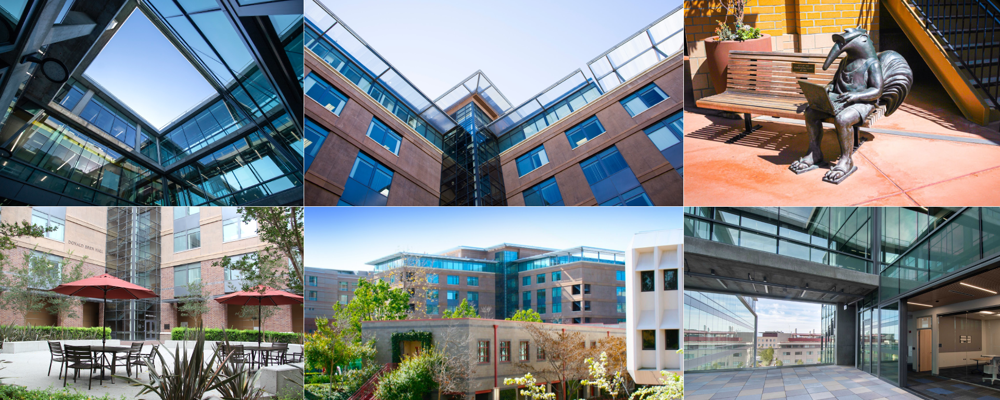

```{r, echo = FALSE, warning = FALSE}
library(fontawesome)
```

{width="100%"}

The program meets daily from 9 am - 3:30 pm in DBH 2011, unless otherwise specified.
Lunch will be from noon to 1pm.

Make sure to join our **Slack workspace**, you should have received an email.
You may want to download the Slack app because we will be using this for communication throughout the program.
Make sure notifications are on.

## Day 1 - June 22, 2025


