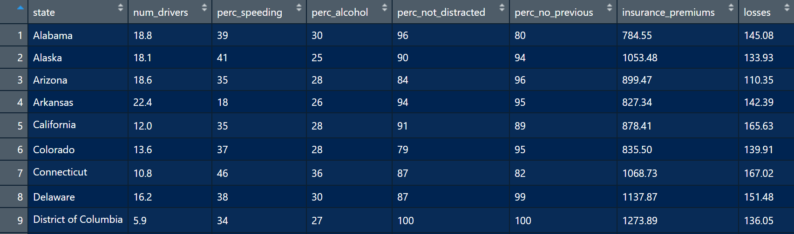
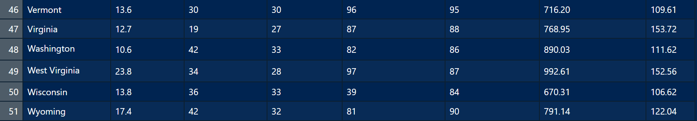
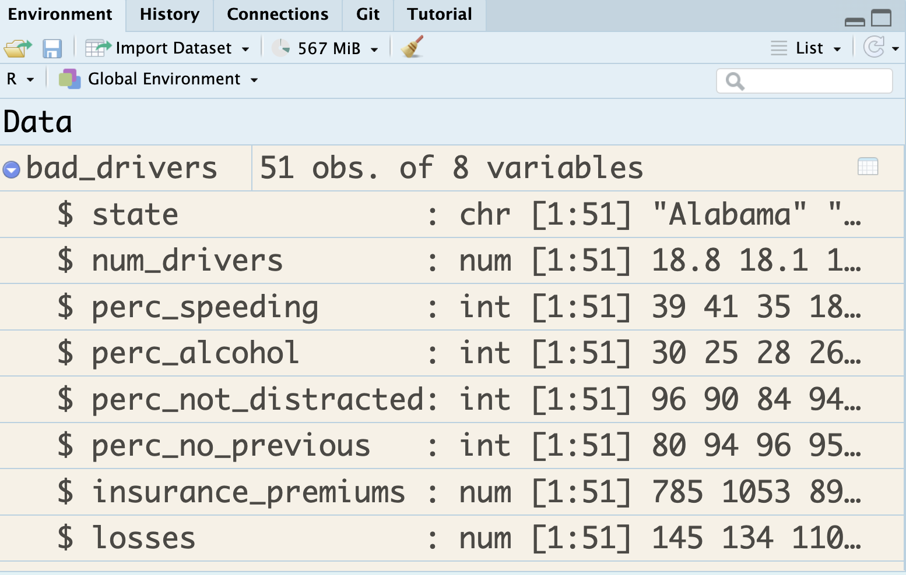
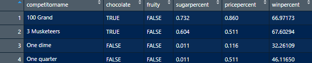
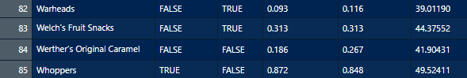
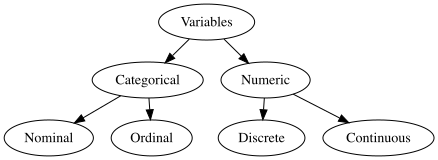

```{r}
#| echo: false
#| message: false
#| warning: false
library(fivethirtyeight)
library(openintro)
library(tidyverse)
library(DiagrammeR)
library(DiagrammeRsvg)
library(janitor)
library(rsvg)
library(bayesrules)
data(bad_drivers)
candy_rankings <- candy_rankings |> 
  select(competitorname, chocolate, fruity, sugarpercent, pricepercent, winpercent)
data(football)
```


# Getting to Know Data Frames

[Dear Mona, Which State Has the Worst Drivers?](https://fivethirtyeight.com/features/which-state-has-the-worst-drivers/)

```{r}
library(fivethirtyeight)
library(tidyverse)
data("bad_drivers")
```


## Data Frame

```{r echo=FALSE, out.width='100%'}


```

## Data Frame

- The data frame has `r ncol(bad_drivers)` __variables__ (state, num_drivers, perc_speeding, perc_not_distracted, perc_no_previous, insurance_premiums, losses). 

- The data frame has `r nrow(bad_drivers)` __cases__ or __observations__. Each case represents a US state (or District of Columbia). 

## Data documentation

```{r}
?bad_drivers
```

`state` State

`num_drivers` Number of drivers involved in fatal collisions per billion miles

`perc_speeding` Percentage of drivers involved in fatal collisions who were speeding

`perc_alcohol` Percentage of drivers involved in fatal collisions who were alcohol-impaired

`perc_not_distracted` Percentage of drivers involved in fatal collisions who were not distracted

##

`perc_no_previous` Percentage of drivers involved in fatal collisions who had not been involved in any previous accidents

`insurance_premiums` Car insurance premiums ($)

`losses` Losses incurred by insurance companies for collisions per insured driver ($)

`Source` National Highway Traffic Safety Administration 2012, National Highway Traffic Safety Administration 2009 & 2012, National Association of Insurance Commissioners 2010 & 2011.


##

```{r}
head(bad_drivers)
```

## 

```{r}
tail(bad_drivers)
```

##

```{r}
glimpse(bad_drivers)
```

##

```{r}
ncol(bad_drivers)
```

##

```{r}
nrow(bad_drivers)
```

## Getting to Know the Data Frame 


```{r}
#| echo: false
#| out-width: 100%
#| fig-align: center

```

##

```{r}
glimpse(candy_rankings)
```

##

```{r}
glimpse(bob_ross)
```

##

```{r}
glimpse(mariokart)
```

## Variables

```{r echo=FALSE, out.width='100%'}


```

## In Statistics

```{r echo = FALSE, fig.align='center'}
#| echo: false
#| fig-align: center
#| out-width: 80%
diagram <- grViz("
    digraph {
        # graph aesthetics
        graph [ranksep = 0.3]

        # node definitions with substituted label text
        1 [label = 'Variables']
        2 [label = 'Categorical']
        3 [label = 'Numeric']
        4 [label = 'Nominal']
        5 [label = 'Ordinal']
        6 [label = 'Discrete']
        7 [label = 'Continuous']

        
        # edge definitions with the node IDs
        1 -> 2
        1 -> 3
        2 -> 4
        2 -> 5
        3 -> 6
        3 -> 7
    }
")

tmp <- capture.output(rsvg_png(charToRaw(export_svg(diagram)),'img/diagram.png'))

 

```

## (Some) Variable Types in R

`character`: takes string values (e.g. a person's name, address)  

. . .

`integer`: integer (single precision)  

. . .

`double`: floating decimal (double precision)   

. . .

`numeric`: integer or double  

. . .

`factor`: categorical variables with different levels  

. . .

`logical`: TRUE (1), FALSE (0)  


## 

As a data scientist it is **your** job to check the type(s) of data that you are working with. Do **not**  assume you will work with clean data frames, with clean names, labels, and types.

# Describing Data with Numbers

## Data

```{r}
library(bayesrules)
data(football)
glimpse(football)
```

## Data

```{r}
#| echo: false
football |> 
  select(volume, group) |> 
  glimpse()
```

What kind of variables are these two?

##

Categorical data are summarized with **counts** or **proportions**


##

```{r}
count(football, group)
```


##

```{r}
count(football, group, sort = TRUE)
```

##

```{r}
janitor::tabyl(football, group)
```


# Summarizing Numerical Data


## Mean

::::{.columns}
::: {.column width="50%"}

```{r}
summarize(football, 
          mean(volume))
```

::: 

::: {.column width="50%"}

```{r}
mean(football$volume)
```

:::

::::

## Median

::::{.columns}

::: {.column width="50%"}

```{r}
summarize(football, 
          median(volume))
```

::: 

::: {.column width="50%"}

```{r}
median(football$volume)
```

:::

::::


## Minimum

::::{.columns}

::: {.column width="50%"}

```{r}
summarize(football, 
          min(volume))
```

::: 

::: {.column width="50%"}

```{r}
min(football$volume)
```

:::

::::

In a similar fashion maxiumum can be found by using the `max()` function.

## Standard deviation

::::{.columns}

::: {.column width="50%"}

```{r}
summarize(football, 
          sd(volume))
```

::: 

::: {.column width="50%"}

```{r}
sd(football$volume)
```

:::

::::

## Variance

::::{.columns}

::: {.column width="50%"}

```{r}
summarize(football, 
          var(volume))
```

::: 

::: {.column width="50%"}

```{r}
var(football$volume)
```

:::

::::

## Quantiles / Percentiles / Quartiles

<style type="text/css">
.tg  {border-collapse:collapse;border-spacing:0;}
.tg td{border-color:black;border-style:solid;border-width:1px;font-family:Arial, sans-serif;font-size:14px;
  overflow:hidden;padding:10px 5px;word-break:normal;}
.tg th{border-color:black;border-style:solid;border-width:1px;font-family:Arial, sans-serif;font-size:14px;
  font-weight:normal;overflow:hidden;padding:10px 5px;word-break:normal;}
.tg .tg-7rfc{border-color:inherit;font-family:Arial, Helvetica, sans-serif !important;;font-size:28px;text-align:left;
  vertical-align:top}
</style>
<table class="tg">
<thead>
  <tr>
    <th class="tg-7rfc">Quantile</th>
    <th class="tg-7rfc">Percentile</th>
    <th class="tg-7rfc">Special Name</th>
  </tr>
</thead>
<tbody>
  <tr>
    <td class="tg-7rfc">0.25</td>
    <td class="tg-7rfc">25th</td>
    <td class="tg-7rfc">First quartile</td>
  </tr>
  <tr>
    <td class="tg-7rfc">0.5</td>
    <td class="tg-7rfc">50th</td>
    <td class="tg-7rfc">Median</td>
  </tr>
  <tr>
    <td class="tg-7rfc">0.75</td>
    <td class="tg-7rfc">75th</td>
    <td class="tg-7rfc">Third quartile</td>
  </tr>
</tbody>
</table>

## Quantiles

```{r}
summarize(football, q1 = quantile(volume, 0.25), 
          median = quantile(volume, 0.50), 
          q3 = quantile(volume, 0.75))
```

```{r echo = FALSE}
q1 <- summarize(football, quantile(volume, c(0.25))) |> 
  pull()
```


##

We can get multiple summaries with one `summarize()` function.


```{r}
summarize(football,
          mean(volume),
          median(volume))
```

Note how the variables names in this table is not easy to read. 

##


In order to display the variable names more legibly in the output, we can assign variable names to numerical summaries (e.g. `mean_volume`).

```{r}
summarize(football,
          mean_volume = mean(volume),
          med_volume = median(volume))
```

# Importing Data

So far we have used data that were part of R packages. What if we wanted to download a dataset online?


## Importing .csv Data 


```{r}
#| echo: true
#| eval: false
readr::read_csv("dataset.csv")
```


## Importing Excel Data

```{r}
#| echo: true
#| eval: false
readxl::read_excel("dataset.xlsx")
```


## Importing Excel Data

```{r}
#| echo: true
#| eval: false
readxl::read_excel("dataset.xlsx", sheet = 2)
```


## Importing SAS, SPSS, Stata Data

```{r}
#| echo: true
#| eval: false
library(haven)
# SAS
read_sas("dataset.sas7bdat")
# SPSS
read_sav("dataset.sav")
# Stata
read_dta("dataset.dta")
```


## Where is the dataset file?

Importing data will depend on where the dataset is on your computer. However we use the help of `here::here()` function. 
This function sets the working directory to the project folder (i.e. where the `.Rproj` file is).

```{r}
#| echo: true
#| eval: false
read_csv(here::here("data/dataset.csv"))
```

## Practice

Download and import

1. [Restaurant and Market Health Inspections](https://data.lacity.org/Community-Economic-Development/Restaurant-and-Market-Health-Inspections/29fd-3paw/about_data) from City of LA.

2. - [HIV Antibody Test](https://wwwn.cdc.gov/nchs/nhanes/search/datapage.aspx?Component=Laboratory&CycleBeginYear=2017) Note that the data is in XPT format.

