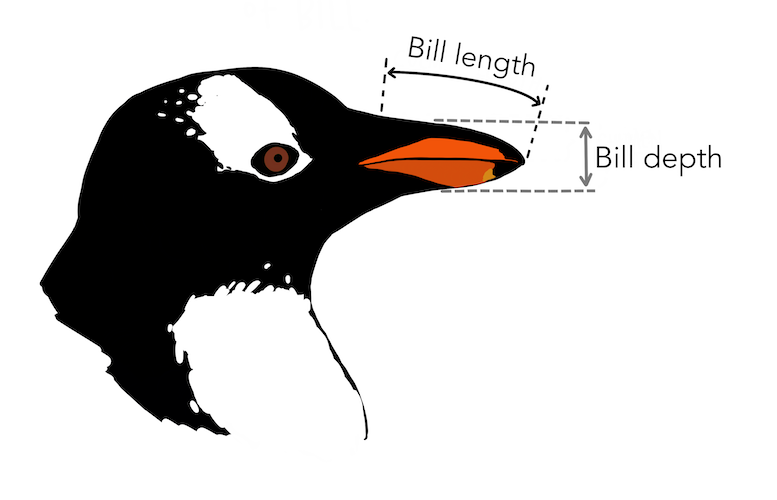

```{r}
#| echo: false
library(openintro)
library(tidyverse)
library(palmerpenguins)
library(fGarch) # for simulating skewed data

theme_set(theme_gray(base_size = 22))

babies <- babies %>% 
  mutate(smoke = as.logical(smoke),
         parity = as.logical(parity))
```


## Different Representations of Data


We can represent data using some of the following formats

- visual
- text
- sound
- tactile

. . .

Today we will cover data represented in visuals but throughout the week we will cover different data representations.

## Accessibility

Data visualization is perhaps the most commonly used format for representing data. 

. . .

Data visualization can convey a lot about data, however visualizations are not accessible to everyone. 
For instance, they are not accessible to those who are blind and visually impaired. 

. . .

Different modes (e.g., sound) of representation are especially important for making the data representation accessible to all. 


# Data Visualization

## Examples

[How Common Is Your Birthday?](https://chart-studio.plotly.com/~Dreamshot/354/how-common-is-your-birthday/#plot)

[One Dataset Visualized 25 Ways](https://flowingdata.com/2017/01/24/one-dataset-visualized-25-ways)

[Mandatory Paid Vacation](https://www.instagram.com/p/CE1kpM5FhWR/?utm_source=ig_web_copy_link)

[Why are K-pop groups so big?](https://pudding.cool/2020/10/kpop/)

. . .

We will only touch the surface of data visualization in this class. It is a rich field and some of you may possibly consider a career in data visualization.

##

Data Visualizations

- are graphical representations of data

- use different colors, shapes, and the coordinate system to summarize data

- can tell a story or can be useful for exploring data

## Data

```{r}
library(openintro)
glimpse(babies)
```

##

```{r}
?babies
```

`case` id number

`bwt` birthweight, in ounces

`gestation` length of gestation, in days

`parity` binary indicator for a first pregnancy (0 = first pregnancy)

`age` mother's age in years

`height` mother's height in inches

`weight` mother's weight in pounds

`smoke` binary indicator for whether the mother smokes

## Bar plot

```{r}
#| echo: false
#| fig-align: center
ggplot(babies, aes(x = smoke)) +
  geom_bar()
```

- When can we use a bar plot?
- What does this bar plot convey?

## Bar plot

```{r}
#| output-location: column
ggplot(babies)
```

## Bar plot

```{r}
#| output-location: column
ggplot(babies, aes(x = smoke)) 
```

## Bar plot

```{r}
#| output-location: column
ggplot(babies, aes(x = smoke)) +
  geom_bar()
```

## Histogram

```{r}
#| echo: false
#| fig-align: center
ggplot(babies, aes(x = bwt)) +
  geom_histogram()
```

- When can we use an histogram?
- What does this histogram convey?

## Histogram

```{r}
#| output-location: column
ggplot(babies)
```

## Histogram

```{r}
#| output-location: column
ggplot(babies, aes(x = bwt))
```

## Histogram

```{r}
#| output-location: column
ggplot(babies, aes(x = bwt)) +
  geom_histogram()
```

## 

::: {.panel-tabset group="binwidth"}

## Binwidth = 0.5

```{r}
#| echo: false
ggplot(babies, aes(x = bwt)) +
  geom_histogram(binwidth = 0.5)
```

## Binwidth = 3

```{r}
#| echo: false
ggplot(babies, aes(x = bwt)) +
  geom_histogram(binwidth = 3)
```

## Binwidth = 10

```{r}
#| echo: false
ggplot(babies, aes(x = bwt)) +
  geom_histogram(binwidth = 10)
```


:::

## Binwidth

```{r}

ggplot(babies, aes(x = bwt)) +
  geom_histogram(binwidth = 3)
```

##

```{r}
#| echo: false
#| message: false
#| warning: false
#| fig.height: 6
#| cache: true
set.seed(12345)

symmetric <- rnorm(n = 10000, mean = 0, sd = 1)

right_skewed <- rsnorm(n = 10000, mean = 0, sd = 1, xi = 20)

left_skewed <- rsnorm(n = 10000, mean = 0, sd = 1, xi = -20)

type <- c(
  rep("left-skewed", 10000),
  rep("symmetric", 10000),
  rep("right-skewed", 10000)
)

x <- c(left_skewed,
       symmetric,
       right_skewed)

data <- tibble(x = x,
                  type = type)

```

::::{.columns}

:::{.column width="50%"}

```{r}
#| echo: false
data %>% 
  filter(type == "left-skewed") %>% 
  ggplot(aes(x = x)) +
  geom_histogram() +
  labs(title = "Left skewed") +
  theme_classic(base_size = 22) 
```

:::

:::{.column width="50%"}

```{r}
#| echo: false
data %>% 
  filter(type == "symmetric") %>% 
  ggplot(aes(x = x)) +
  geom_histogram() +
  labs(title = "Symmetric") +
  theme_classic(base_size = 22)
```
:::

:::{.column width="50%"}

```{r}
#| echo: false
data %>% 
  filter(type == "right-skewed") %>% 
  ggplot(aes(x = x)) +
  geom_histogram() +
  labs(title = "Right skewed") +
  theme_classic(base_size = 22)
```

:::

::::


## Histogram

Consider the height distribution in our class.

- How would the distribution change if Michael Jordan (198.1 cm, 6' 6'') were to join our class?

- How would the distribution change if Tyrion Lannister (Peter Dinklage)  (135 cm, 4' 5'') were to join our class?


## 

Think 💭 - Pair 👫🏽 - Share 💬

- In right-skewed distributions mean > median, true or false?

- In left-skewed distributions mean > median, true or false?

. . .

When data display a skewed distribution we rely on median rather than the mean to understand the center of the distribution.

## More on Histograms

[There is no "best" number of bins](https://en.wikipedia.org/wiki/Histogram#Number_of_bins_and_width)

[Exploring Histograms Visually](https://tinlizzie.org/histograms/)

Take a look at these for fun.

## Looking at Relationships

So far we seen barplots and histograms both of which are useful for visualizing categorical and numerical variables respectively. 

. . .

We are often interested in looking at relationships between two variables. 
We have statistical tests to examine such relationships. 
However, visualizations can often help us explore if such relationships are worth looking into. 

## Standardized Bar Plots

```{r}
#| output-location: column
#| fig-align: center
#| code-line-numbers: "|3|4"
ggplot(data = babies,
       aes(x = smoke, 
           fill = parity)) + 
  geom_bar(position = "fill")
```

Note that the y axis still shows as a count. We will learn how to change the axis labels in the next lecture.

## Dodged Bar Plot

```{r}
#| output-location: column
#| fig-align: center
#| code-line-numbers: "|3|4"
ggplot(data = babies,
       aes(x = smoke, 
           fill = parity)) + 
  geom_bar(position = "dodge")
```

## Side-by-Side Boxplots

```{r}
#| output-location: column
#| fig-align: center
#| code-line-numbers: "|3|4"
ggplot(babies,
       aes(x = smoke,
           y = bwt))  +
  geom_boxplot() 
```


## Scatter plots

```{r}
#| output-location: column
#| fig-align: center
ggplot(babies,
       aes(x = gestation,
           y = bwt))  +
  geom_point()
```

Length of gestation can **possibly** eXplain a baby's birth weight. 
Gestation is the eXplanatory variable and is shown on the x-axis.
Birth weight is the response variable and is shown on the y-axis.

---

## Linear Relationship

```{r echo = FALSE, fig.height=4, fig.align='center', warning=FALSE, message=FALSE}
ggplot(babies,
       aes(x = gestation,
           y = bwt))  +
  geom_point() +
  labs(x = "Gestation (days)",
       y = "Birth weight (ounces)") +
  geom_smooth(method = "lm", se = FALSE)
```

Later on we will start statistical modeling during which we will numerically define the relationship between gestation and birth weight. 
For now we can say that this relationship looks positive and moderate.


## Meet Palmer Penguins[^1]


```{r}
#| echo: false
#| fig-align: center
knitr::include_graphics("img/penguins.png")
```


[^1]: Penguin artworks by @allison_horst.

##

```{r}
#| echo: false
#| fig-align: center

```

## Data


```{r}
library(palmerpenguins)
glimpse(penguins)
```

## Visualizing Three Variables

```{r}
#| fig-align: center
#| output-location: column
ggplot(penguins, 
       aes(x = body_mass_g, 
           y = bill_length_mm,
           color = species)) +
  geom_point()
```

## code style

[The tidyverse style guide](https://style.tidyverse.org/ggplot2.html) has the following convention for writing ggplot2 code.

The plus sign for adding layers `+` always has a space before it and is followed by a new line. 

The new line is indented by two spaces. RStudio does this automatically for you. 

## Labeling Axes

```{r}
#| output-location: column
#| code-line-numbers: "6|7|8"
ggplot(penguins,
       aes(x = bill_depth_mm,
           y = bill_length_mm,
           color = species)) +
  geom_point() +
  labs(x = "Bill Depth (mm)", 
       y = "Bill Length (mm)",
       color = "Species",
       title = "Palmer Penguins") 
```

We can change axes and plot labels using the `labs()` function. 


## Themes

::: {.panel-tabset}
## `theme_gray()`

```{r}
#| code-line-numbers: "9"
#| output-location: column
ggplot(penguins,
       aes(x = bill_depth_mm,
           y = bill_length_mm,
           color = species)) +
  geom_point() +
  labs(x = "Bill Depth (mm)", 
       y = "Bill Length (mm)", 
       title = "Palmer Penguins") +
  theme_gray()
```

Theme gray is the default theme in ggplot.

## `theme_bw()`

```{r}
#| output-location: column
#| code-line-numbers: "9"
ggplot(penguins,
       aes(x = bill_depth_mm,
           y = bill_length_mm,
           color = species)) +
  geom_point() +
  labs(x = "Bill Depth (mm)", 
       y = "Bill Length (mm)", 
       title = "Palmer Penguins") +
  theme_bw()
```

## `theme_dark()`

```{r}
#| output-location: column
#| code-line-numbers: "9"
ggplot(penguins,
       aes(x = bill_depth_mm,
           y = bill_length_mm,
           color = species)) +
  geom_point() +
  labs(x = "Bill Depth (mm)", 
       y = "Bill Length (mm)", 
       title = "Palmer Penguins") +
  theme_dark()
```


## `theme_classic()`

```{r}
#| output-location: column
#| code-line-numbers: "9"
ggplot(penguins,
       aes(x = bill_depth_mm,
           y = bill_length_mm,
           color = species)) +
  geom_point() +
  labs(x = "Bill Depth (mm)", 
       y = "Bill Length (mm)", 
       title = "Palmer Penguins") +
  theme_classic()
```


## `theme_minimal()`


```{r}
#| code-line-numbers: "9"
#| output-location: column
ggplot(penguins,
       aes(x = bill_depth_mm,
           y = bill_length_mm,
           color = species)) +
  geom_point() +
  labs(x = "Bill Depth (mm)", 
       y = "Bill Length (mm)", 
       title = "Palmer Penguins") +
  theme_minimal()
```


:::

## Font Size


```{r}
#| code-line-numbers: "9"
#| output-location: column
ggplot(penguins,
       aes(x = bill_depth_mm,
           y = bill_length_mm,
           color = species)) +
  geom_point() +
  labs(x = "Bill Depth (mm)", 
       y = "Bill Length (mm)", 
       title = "Palmer Penguins") +
  theme(text = element_text(size=20))
```

The `theme()` function allows for many components of a theme. By typing `?theme` in the Console, you can read the documentation of the function to see what components can be modified.

## Font Size

One can also set the default font size of theme. For instance, if you utilize the following code at the first chunk of a Quarto document, all plots will be in gray theme and will have a font size of 22.

```{r}
theme_set(theme_gray(base_size = 22))
```


## Using Shapes in Addition to Colors

```{r}
#| output-location: column
#| code-line-numbers: "4"
ggplot(penguins,
       aes(x = bill_depth_mm,
           y = bill_length_mm,
           shape = species,
           color = species)) +
  geom_point(size = 4) 
```

Previously species were only distinguishable to someone who could distinguish these colors. 
By using shapes, color-blind viewers can also distinguish the species.


## Practice

Using the `penguins` data frame ask a question that you are interested in answering. Visualize data to get a visual answer to the question. What is the visual telling you? Note all of this down in your lecture notes.


