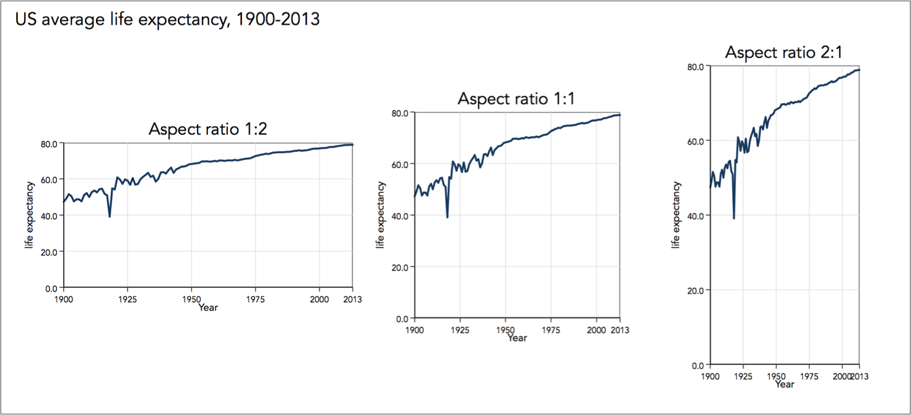
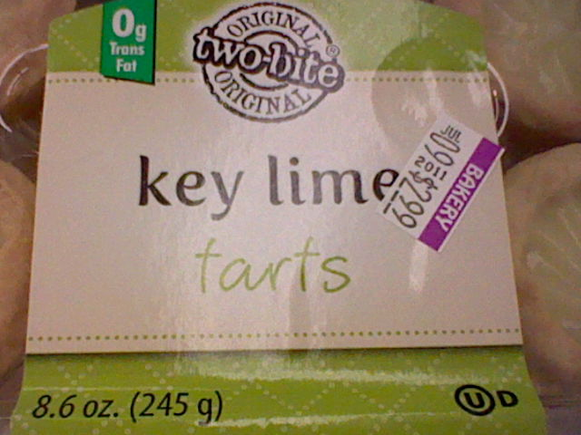
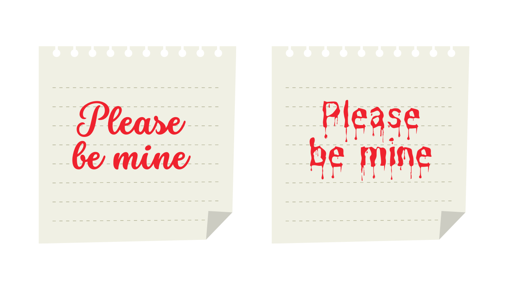
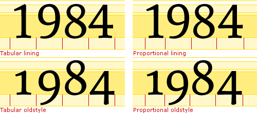
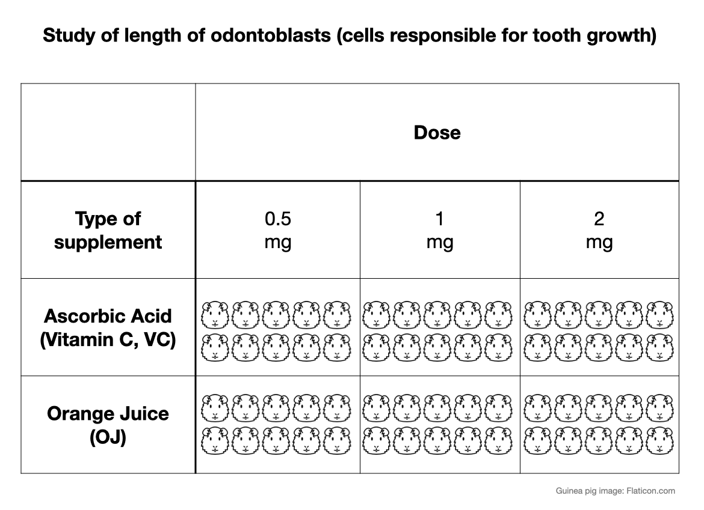

```{r}
#| echo: false
library(knitr)
library(tidyverse)
library(palmerpenguins)
sysfonts::font_add_google("Enriqueta")
sysfonts::font_add_google("Cabin")
showtext::showtext_auto()
```

## ggplot resources

We have barely touched the surface of ggplot2.

- [ggplot2 cheatsheet](https://posit.co/wp-content/uploads/2022/10/data-visualization-1.pdf)
- [ggplot2 book](https://ggplot2-book.org/)
- 
[There are many ggplot adjacent packages.](https://exts.ggplot2.tidyverse.org/gallery/)


# Some important principles for data visualization

## Aspect ratio

```{r}
#| fig-align: center
#| echo: false
#| out-width: 50%
#| fig-alt: three plots with same data. The x-axis always has year and the y-axis always has life expectancy. The plots are labeled as aspect ration 1:2, aspect ration 1:1, and aspect ration 2:1. In the first plot the x axis is double the y axis. In the third plot the y axis is double that of x axis. Thus in the first plot the trend can be perceived to have a low positive slope where as in the third plot the trend seems like a steeper positive change. 

```


:::{.imagelink}
[Image source](https://graphworkflow.com/enhancement/aspect/)
:::


# Choose colors with a purpose

## Color Theory

```{r}
#| fig-align: center
#| echo: false
#| fig-alt: The Hue bar (top) shows the full range of color hues mapped to degrees from 0° to 360°, wrapping around the color wheel—starting at red, through yellow, green, blue, magenta, and back to red. The Saturation bar (middle) shows how "intense" or "pure" the color is, going from 0% (completely desaturated, i.e., grayscale) to 100% (fully saturated, pure color). The Lightness/Brightness bar (bottom) shows how light or dark the color is, from 0% (black) to 100% (white), with the pure color appearing in the middle when lightness is 50%.
include_graphics("https://giggster.com/guide/static/fed42130c194b0c240a4ec10408adf97/8282f/hsl-cover-2.png")
```

:::{.imagelink}
[Image source](https://giggster.com/guide/static/fed42130c194b0c240a4ec10408adf97/8282f/hsl-cover-2.png)
:::

## How to Pick a Color Palette


:::{.font75}
[Adobe - Color Wheel](https://color.adobe.com/create/color-wheel)
:::

. . .

:::{.font75}

[Okabe-Ito Color Palette](https://siegal.bio.nyu.edu/color-palette/)

:::
. . .

:::{.font75}
[Color Blindness Simulator](https://github.com/clauswilke/colorblindr)
:::

. . .

:::{.font75}
[vis4.net/palettes](https://www.vis4.net/palettes)
:::


## Okabe-Ito Color Palette 

In 2008, [Masataka Okabe and Kei Ito](https://jfly.uni-koeln.de/color/) proposed a color palette that is accessible to people with various color deficiencies. 
We use their last names referring to the color palette. 


```{r}
#| echo: true
palette.colors(palette = "Okabe-Ito")
```

## Okabe-Ito Color Palette 

```{r}
#| echo: false
#| fig-align: center 
scales:::show_col(palette.colors(palette = "Okabe-Ito"))
```

The codes displayed with a hashtag are called hex color code. You can use hex codes in R (and in HTML) to specify colors.

## Color-Blindness Simulation

```{r}
species_bills <- 
  ggplot(penguins,
         aes(x = bill_depth_mm,
             y = bill_length_mm,
             color = species)) +
  geom_point(size = 4) 
```

By storing the plot as an object named `species_bills`, we will be able to use it in other functions.

## Color-Blindness Simulation

```{r}
#| output-location: slide
colorblindr::cvd_grid(species_bills) 
```

The `cvd_grid()` function from the `colorblindr()` package creates a grid of different color-deficiency simulations. 

`Deuteranomaly` is reduced sensitivity to green light
`Protanomaly`, is reduced sensitivity to red light
`Tritanomaly` is reduced sensitivity to blue light 
`Desaturated` is no color difference


## Okabe-Ito Color Palette

```{r}
#| fig-align: center
species_bills + 
  scale_color_manual(values = c("Adelie" = "#E69F00", "Chinstrap" = "#56B4E9", "Gentoo" = "#009E73"))

```

## Okabe-Ito Color Palette

```{r}
#| fig-align: center
species_bills + 
  colorblindr::scale_color_OkabeIto()

```


# Fonts matter


## Fonts matter for clarity


```{r}
#| fig-align: center
#| echo: false
#| fig-alt: a food packaging that reads as key lime tarts but the font used makes the letters t in the words tarts seem like an f instead.

```


:::{.imagelink}
[Image source](https://www.reddit.com/r/funny/comments/rn98p/poor_font_selection/)
:::

## Fonts matter for the message

```{r}
#| fig-align: center
#| echo: false
#| fig-alt: Two postit note both of which say please be mine. The left note is written with a curvy almost cursive font. The right note is written with a font that looks like blood is dripping.

```

:::{.imagelink}
[Image Source](https://www.mysocialdesigner.com/blog/christmas-fonts-in-canva)
:::


##

<br>
<br>

```{r}
#| fig-align: center
#| echo: false
#| fig-alt: Comparison of four numeric styles Tabular Lining, Proportional Lining, Tabular Oldstyle, and Proportional Oldstyle. Each style displays the number '1984'. Tabular styles align numbers to equal widths; proportional styles use variable widths. Lining styles have uniform height; oldstyle styles use varying heights with some digits extending above or below the baseline.

```
:::{.imagelink}
[Image source](https://discussions.apple.com/thread/8001888?sortBy=rank)
:::

. . .

:::{.callout-tip}
Use lining and tabular fonts for numbers.
:::

##

<br>
<br>
<br>

:::{.font75}
[Google Fonts](https://fonts.google.com/)
:::

##

```{r}
sysfonts::font_add_google("Cabin")

ggplot(data = penguins,
       aes(x = bill_length_mm)) +
  geom_histogram() +
  labs(title = "Distribution of Bill Lengths of Palmer Penguins") +
     theme(text = element_text(family = "Cabin"))

```


# Write alternate text

## Screen reader example

<div class="horizontal-center">

<iframe width="560" height="315" src="https://www.youtube.com/embed/l-G4kKTuDHI" title="YouTube video player" frameborder="0" allow="accelerometer; autoplay; clipboard-write; encrypted-media; gyroscope; picture-in-picture" allowfullscreen></iframe>

The video shows use of a screen reader briefly. 

</div>

## Alternate Text

:::{.nonincremental}
- "Alt text" describes contents of an image. 
- Screen-readers cannot read images but can read alt text. 
- Alt text has to be provided. 

:::


## Manual Alternate Text
:::{.nonincremental}

:::: {.columns}

::: {.column width="50%"}
- Chart type

- Type of data

- Reason for including the chart

- Link to data or source (not in alt text but in main text)


[Cesal, 2020](https://medium.com/nightingale/writing-alt-text-for-data-visualization-2a218ef43f81)
:::

::: {.column width="50%"}
- Description conveys meaning in the data

- Variables included on the axes

- Scale described within the description

- Type of plot is described

[Canelón & Hare, 2021 ](https://www.youtube.com/watch?v=DxLkv2iRdf8&ab_channel=csvconf)
:::

::::

:::


## Alt Text in Quarto

```{r}
#| echo: fenced
#| fig-align: center
#| fig-cap: Relationship between bill depth (mm) and length (mm) for different species of penguins
#| fig-alt: The scatterplot shows bill depth in mm on the x-axis and bill length in mm on the y-axis with points differently colored for different species as Adelie, Chinstrap, and Gentoo. The x axis ranges from about 12.5 mm to 22.5 mm. The y-axis ranges from about 30 to 60 mm. For all species the relationship seems moderately positive. When comparing the three species, Adelie penguins seem to have longer bill depth but shorter bill length. Chinstraps have longer bill depth and longer bill length. Gentoo penguins have shorter bill depth and longer bill length.  

ggplot(penguins, aes(x = bill_depth_mm,
                     y = bill_length_mm,
                     color = species)) +
  geom_point(size = 4) 
```

## Caption vs. Alt Text

Figure captions (`fig-cap`) appear on the front-end of a document and is accessible to all whether they are reading it directly or via screen readers. 

Figure alternate text (`fig-alt`) only appears on the back-end of a document and is accessible to screen readers and those who know how to investigate the source code of a (HTML) document. 

Even though, we are using captions and alternate text in Quarto, these are available features in many other software (e.g., Google doc, PowerPoint etc.)


# An example

Many design decisions go into making a data visualization. 
The following example is from one of my favorite data visualization experts [Cara Thompson](https://www.cararthompson.com/) shared with CC-BY license.

## Data context 

```{r}
#| fig-align: center
#| echo: false
#| fig-alt: Table showing a study on odontoblast length (cells responsible for tooth growth) based on type and dose of supplement. The table compares Ascorbic Acid (Vitamin C) and Orange Juice at three doses 0.5 mg, 1 mg, and 2 mg. Each cell in the table contains rows of guinea pig face icons representing individual subjects in each condition.

```


##

```{r}
#| fig-alt: This is a bar plot with x axis labeled as 0.5, 1, and 2 for each bar. Within each bar we see two colors red and blue. In the legend the supp variable is defined with red as OJ and blue as VC. The y-axis shows mean-length.
#| echo: false
initial_plot <- ToothGrowth |>
  group_by(supp, dose) |>
  summarise(mean_length = mean(len)) |>
  ggplot(aes(x = dose,
             y = mean_length,
             fill = supp)) +
  geom_bar(stat = "identity")

initial_plot
```

## 

```{r}
#| fig-alt: this plot is a dodged barplot where the OJ and VC supp is shown next to each other as separate bars.
#| echo: false
ToothGrowth |>
  group_by(supp, dose) |>
  summarise(mean_length = mean(len)) |>
  ggplot(aes(x = dose,
             y = mean_length,
             fill = supp)) +
  geom_bar(stat = "identity",
           position = "dodge")
```

##

```{r}
#| fig-alt: that bars get a white outline
#| echo: false
ToothGrowth |>
  group_by(supp, dose) |>
  summarise(mean_length = mean(len)) |>
  ggplot(aes(x = dose,
             y = mean_length,
             fill = supp)) +
  geom_bar(stat = "identity",
           position = "dodge", 
           colour = "#FFFFFF",
           size = 2)
```

##

```{r}
#| fig-alt: the legend text changes to supplement, Orange Juice, and Vitamin C
#| echo: false
ToothGrowth |>
  mutate(supplement = 
           case_when(supp == "OJ" ~ "Orange Juice",
                     supp == "VC" ~ "Vitamin C",
                     TRUE ~ as.character(supp))) |>
  group_by(supplement, dose) |>
  summarise(mean_length = mean(len)) |>
  ggplot(aes(x = dose,
             y = mean_length,
             fill = supplement)) +
  geom_bar(stat = "identity",
           position = "dodge", 
           colour = "#FFFFFF",
           size = 2)
```

##

```{r}
#| fig-alt: the gray background is replace with a white one
#| echo: false
ToothGrowth |>
  mutate(supplement = 
           case_when(supp == "OJ" ~ "Orange Juice", supp == "VC" ~ "Vitamin C", TRUE ~ as.character(supp))) |>
  group_by(supplement, dose) |>
  summarise(mean_length = mean(len)) |>
  ggplot(aes(x = dose,
             y = mean_length,
             fill = supplement)) +
  geom_bar(stat = "identity",
           position = "dodge", 
           colour = "#FFFFFF",
           size = 2) +
  theme_minimal()
```


##

```{r}
#| fig-alt: the x axis is now labeled as categorical_dose and there is no value of 1.5 which was initially a gap between dose 1 and dose 2 bars.
#| echo: false
ToothGrowth |>
  mutate(supplement = case_when(supp == "OJ" ~ "Orange Juice", supp == "VC" ~ "Vitamin C", TRUE ~ as.character(supp))) |>
  group_by(supplement, dose) |>
  summarise(mean_length = mean(len)) |>
  mutate(categorical_dose = factor(dose)) |>
  ggplot(aes(x = categorical_dose,
             y = mean_length,
             fill = supplement)) +
  geom_bar(stat = "identity",
           position = "dodge",
           colour = "#FFFFFF", 
           size = 2) +
  theme_minimal()
```

##

```{r}
#| fig-alt: the orange juice and vitamin c is separated into two facets with orange juice on top as a separate bar plot.
#| echo: false
ToothGrowth |>
  mutate(supplement = case_when(supp == "OJ" ~ "Orange Juice", supp == "VC" ~ "Vitamin C", TRUE ~ as.character(supp))) |>
  group_by(supplement, dose) |>
  summarise(mean_length = mean(len)) |>
  mutate(categorical_dose = factor(dose)) |>
  ggplot(aes(x = categorical_dose,
             y = mean_length,
             fill = supplement)) +
  geom_bar(stat = "identity",
           colour = "#FFFFFF", 
           size = 2) + 
  facet_wrap(supplement ~ ., ncol = 1) +
  theme_minimal()
```

##

```{r}
#| fig-alt: There is a title that reads "In smaller doses, Orange Juice was associated with greater mean tooth growth, compared to equivalent doses of Vitamin C" and a subtitle that reads "With the highest dose, the mean recorded length was almost identical." 
#| echo: false
ToothGrowth |>
  mutate(supplement = case_when(supp == "OJ" ~ "Orange Juice", supp == "VC" ~ "Vitamin C", TRUE ~ as.character(supp))) |>
  group_by(supplement, dose) |>
  summarise(mean_length = mean(len)) |>
  mutate(categorical_dose = factor(dose)) |>
  ggplot(aes(x = categorical_dose,
             y = mean_length,
             fill = supplement)) +
  geom_bar(stat = "identity",
           colour = "#FFFFFF", 
           size = 2) + 
  labs(x = "Dose",
       y = "Mean length (mm)",
       title = "In smaller doses, Orange Juice was associated with greater mean tooth growth,
compared to equivalent doses of Vitamin C",
subtitle = "With the highest dose, the mean recorded length was almost identical.") +
  facet_wrap(supplement ~ ., ncol = 1) +
  theme_minimal()
```

##

```{r}
#| fig-alt: Vitamin C bars are now shown with reddish orange color and orange juice is shown with a yellowish orange color.
#| echo: false
vit_c_palette <- c("Orange Juice" = "#fab909", 
                   "Vitamin C" = "#E93603",
                   light_text = "#323A30",
                   dark_text =  "#0C1509")

ToothGrowth |>
  mutate(supplement = case_when(supp == "OJ" ~ "Orange Juice", supp == "VC" ~ "Vitamin C", TRUE ~ as.character(supp))) |>
  group_by(supplement, dose) |>
  summarise(mean_length = mean(len)) |>
  mutate(categorical_dose = factor(dose),
         supplement = 
           factor(supplement, 
                  levels = c("Vitamin C", 
                             "Orange Juice"))) |>
  ggplot(aes(x = categorical_dose,
             y = mean_length,
             fill = supplement)) +
  geom_bar(stat = "identity",
           colour = "#FFFFFF", 
           size = 2) + 
  labs(x = "Dose",
       y = "Mean length (mm)",
       title = "In smaller doses, Orange Juice was associated with greater mean tooth growth,
compared to equivalent doses of Vitamin C",
subtitle = "With the highest dose, the mean recorded length was almost identical.") +
  scale_fill_manual(values = vit_c_palette) +
  facet_wrap(supplement ~ ., ncol = 1) +
  theme_minimal()
```

##

```{r}
#| fig-alt: dose is introduced to legend with lower-to high dose ranging in light to dark. This change is reflected in the colors of the bars too.
#| echo: false
ToothGrowth |>
  mutate(supplement = case_when(supp == "OJ" ~ "Orange Juice", supp == "VC" ~ "Vitamin C", TRUE ~ as.character(supp))) |>
  group_by(supplement, dose) |>
  summarise(mean_length = mean(len)) |>
  mutate(categorical_dose = factor(dose)) |>
  ggplot(aes(x = categorical_dose,
             y = mean_length,
             fill = supplement)) +
  geom_bar(aes(alpha = dose),
           stat = "identity",
           colour = "#FFFFFF", 
           size = 2) + 
  labs(x = "Dose",
       y = "Mean length (mm)",
       title = "In smaller doses, Orange Juice was associated with greater mean tooth growth,
compared to equivalent doses of Vitamin C",
subtitle = "With the highest dose, the mean recorded length was almost identical.") +
  scale_fill_manual(values = vit_c_palette, limits = force) +
  scale_alpha(range = c(0.33, 1)) +
  facet_wrap(supplement ~ ., ncol = 1) +
  theme_minimal()
```


##

```{r}
#| fig-alt: legend is removed
#| echo: false
ToothGrowth |>
  mutate(supplement = case_when(supp == "OJ" ~ "Orange Juice", supp == "VC" ~ "Vitamin C", TRUE ~ as.character(supp))) |>
  group_by(supplement, dose) |>
  summarise(mean_length = mean(len)) |>
  mutate(categorical_dose = factor(dose)) |>
  ggplot(aes(x = categorical_dose,
             y = mean_length,
             fill = supplement)) +
  geom_bar(aes(alpha = dose),
           stat = "identity",
           colour = "#FFFFFF", 
           size = 2) + 
  labs(x = "Dose",
       y = "Mean length (mm)",
       title = "In smaller doses, Orange Juice was associated with greater mean tooth growth,
compared to equivalent doses of Vitamin C",
subtitle = "With the highest dose, the mean recorded length was almost identical.") +
  scale_fill_manual(values = vit_c_palette, limits = force) +
  scale_alpha(range = c(0.33, 1)) +
  facet_wrap(supplement ~ ., ncol = 1) +
  scale_x_discrete(breaks = c("0.5", "1", "2"), labels = function(x) paste0(x, " mg/day")) +
  theme_minimal() +
  theme(legend.position = "none")
```

##

```{r}
#| fig-alt: x and y axis are flipped
#| echo: false
basic_plot <- ToothGrowth |>
  mutate(supplement = case_when(supp == "OJ" ~ "Orange Juice", supp == "VC" ~ "Vitamin C", TRUE ~ as.character(supp))) |>
  group_by(supplement, dose) |>
  summarise(mean_length = mean(len)) |>
  mutate(categorical_dose = factor(dose)) |>
  ggplot(aes(x = categorical_dose,
             y = mean_length,
             fill = supplement)) +
  geom_bar(aes(alpha = dose),
           stat = "identity",
           colour = "#FFFFFF", 
           size = 2) + 
  labs(x = "Dose",
       y = "Mean length (mm)",
       title = "In smaller doses, Orange Juice was associated with greater mean tooth growth,
compared to equivalent doses of Vitamin C",
subtitle = "With the highest dose, the mean recorded length was almost identical.") +
  scale_fill_manual(values = vit_c_palette, limits = force) +
  scale_alpha(range = c(0.4, 1)) +
  scale_x_discrete(breaks = c("0.5", "1", "2"), labels = function(x) paste0(x, " mg/day")) +
  coord_flip() +
  facet_wrap(supplement ~ ., ncol = 1) +
  theme_minimal() +
  theme(legend.position = "none")
basic_plot
```


##

```{r}
#| echo: false
#| fig-alt: title is bolded, fonts have changed.
basic_plot +
  theme(legend.position = "none",
        text = element_text(colour = vit_c_palette["light_text"],
                            family = "Cabin"),
        plot.title = element_text(colour = vit_c_palette["dark_text"], 
                                  size = rel(1.5), 
                                  face = "bold",
                                  family = "Enriqueta"),
        strip.text = element_text(family = "Enriqueta",
                                  colour = vit_c_palette["light_text"], 
                                  size = rel(1.1), face = "bold"),
        axis.text = element_text(colour = vit_c_palette["light_text"]))
```
##

```{r}
#| fig-alt: white space is added between subtitle and the plots
#| echo: false
basic_plot +
  theme(legend.position = "none",
        text = element_text(colour = vit_c_palette["light_text"], 
                            family = "Cabin"),
        plot.title = element_text(colour = vit_c_palette["dark_text"], 
                                  size = rel(1.5), 
                                  face = "bold",
                                  family = "Enriqueta",
                                  lineheight = 1.3,
                                  margin = margin(0.5, 0, 1, 0, "lines")),
        plot.subtitle = element_text(size = rel(1.1), lineheight = 1.3,
                                     margin = margin(0, 0, 1, 0, "lines")),
        strip.text = element_text(family = "Enriqueta",
                                  colour = vit_c_palette["light_text"], 
                                  size = rel(1.1), face = "bold",
                                  margin = margin(2, 0, 0.5, 0, "lines")),
        axis.text = element_text(colour = vit_c_palette["light_text"]))
```

##

```{r}
#| fig-alt: the y-axis label is removed.
#| echo: false
basic_plot +
  theme(legend.position = "none",
        text = element_text(colour = vit_c_palette["light_text"], 
                            family = "Cabin"),
        axis.title.y = element_blank(),
        plot.title = element_text(colour = vit_c_palette["dark_text"], 
                                  size = rel(1.5), 
                                  face = "bold",
                                  family = "Enriqueta",
                                  lineheight = 1.3,
                                  margin = margin(0.5, 0, 1, 0, "lines")),
        plot.subtitle = element_text(size = rel(1.1), lineheight = 1.3,
                                     margin = margin(0, 0, 1, 0, "lines")),
        strip.text = element_text(family = "Enriqueta",
                                  colour = vit_c_palette["light_text"], 
                                  size = rel(1.1), face = "bold",
                                  margin = margin(2, 0, 0.5, 0, "lines")),
        axis.text = element_text(colour = vit_c_palette["light_text"]))
```

##

```{r}
#| fig-alt: reduced the line spacing of two lines of the title
#| echo: false
basic_plot +
  labs(title = "In smaller doses, Orange Juice was associated with greater mean tooth growth, compared to equivalent doses of Vitamin C") +
  theme(legend.position = "none",
        text = element_text(colour = vit_c_palette["light_text"],
                            family = "Cabin"),
        axis.title.y = element_blank(),
        plot.title = ggtext::element_textbox_simple(
          colour = vit_c_palette["dark_text"], 
          size = rel(1.5), 
          face = "bold",
          family = "Enriqueta",
          lineheight = 1.3,
          margin = margin(0.5, 0, 1, 0, "lines")),
        plot.subtitle = ggtext::element_textbox_simple(
          size = rel(1.1), 
          lineheight = 1.3,
          margin = margin(0, 0, 1, 0, "lines")),
        strip.text = element_text(family = "Enriqueta",
                                  colour = vit_c_palette["light_text"],
                                  size = rel(1.1), face = "bold",
                                  margin = margin(2, 0, 0.5, 0, "lines")),
        axis.text = element_text(colour = vit_c_palette["light_text"]))
```

##

```{r}
#| fig-alt: the words orange juice and vitamin c in the title match the corresponding colors of the bars.
#| echo: false
final_plot <- basic_plot +
  labs(title = 
         paste0("In smaller doses, **<span style='color:",
                vit_c_palette["Orange Juice"], "'>Orange Juice</span>**
                      was associated with greater mean tooth growth,
                      compared to equivalent doses of **<span style='color:",
                vit_c_palette["Vitamin C"], "'>Vitamin C</span>**")
  ) +
  theme(legend.position = "none",
        text = element_text(colour = vit_c_palette["light_text"],
                            family = "Cabin"),
        axis.title.y = element_blank(),
        plot.title = ggtext::element_textbox_simple(colour = vit_c_palette["dark_text"], 
                                                    size = rel(1.5), 
                                                    face = "bold",
                                                    family = "Enriqueta",
                                                    lineheight = 1.3,
                                                    margin = margin(0.5, 0, 1, 0, "lines")),
        plot.subtitle = ggtext::element_textbox_simple(family = "Cabin", size = rel(1.1), lineheight = 1.3,
                                                       margin = margin(0, 0, 1, 0, "lines")),
        strip.text = element_text(family = "Enriqueta",
                                  colour = vit_c_palette["light_text"],
                                  size = rel(1.1), face = "bold",
                                  margin = margin(2, 0, 0.5, 0, "lines")),
        axis.text = element_text(colour = vit_c_palette["light_text"]))

final_plot
```

##

::::{.columns}

:::{.column}

```{r}
#| fig-align: center
#| fig-alt: The toothgrowth figure with the initial software defaults
#| echo: false
initial_plot
```

:::

:::{.column}

```{r}
#| fig-align: center
#| fig-alt: The toothgrowth figure after all the desired changes
#| echo: false
final_plot
```

:::
::::

. . .

:::{.callout-tip}
Do not rely on software defaults for font size, font type, colors, labels, text alignment, legend, etc. without intention.
:::
