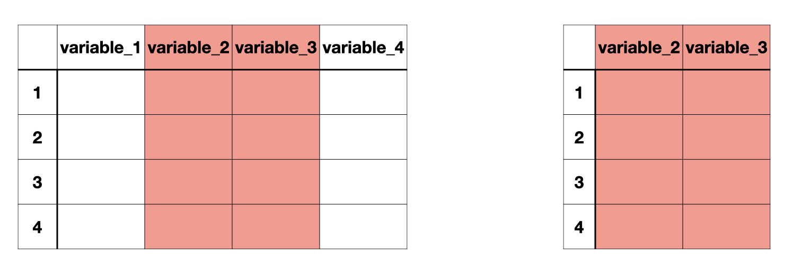
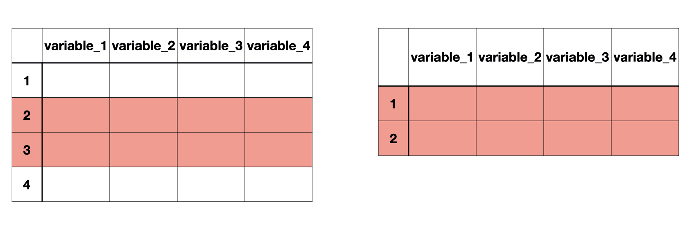

```{r}
#| echo: false
library(tidyverse)
library(janitor)
options(scipen = 999)
```


# Three solutions to a single problem

What is the average of 4, 8, 16 approximately?

##

1.What is the average of <u>4, 8, 16</u> approximately?

. . .

2.What is the <u>average</u> of 4, 8, 16 approximately?

. . .

3.What is the average of 4, 8, 16 <u>approximately</u>?


## Solution 1: Functions within Functions


```{r}
c(4, 8, 16)
```

. . .

<hr>

```{r}
mean(c(4, 8, 16))
```

. . .

<hr>

```{r}
round(mean(c(4, 8, 16)))
```


##

**Problem with writing functions within functions**

Things will get messy and more difficult to read and debug as we deal with more complex operations on data.


## Solution 2: Creating Objects


```{r}
numbers <- c(4, 8, 16)
numbers
```

. . .

<hr>

```{r}
avg_number <- mean(numbers)
avg_number
```

. . .

<hr>

```{r}
round(avg_number)
```

##

**Problem with creating many objects**

We will end up with too many objects in `Environment`. 


## Solution 3: The (forward) Pipe Operator |> 

:::{.font75}
Shortcut: <br>Ctrl (Command) + Shift + M
:::

## 

```{r}
#| echo: false
#| fig-align: center

```

Make sure to select `Use native pipe operator` under `Tools > Global Options > Code`

##

::::{.columns}

:::{.column width="50%"}

```{r}
c(4, 8, 16) |> 
  mean() |> 
  round()
```

:::

:::{.column width="50%"}
Combine 4, 8, and 16 `and then`  
Take the mean   `and then`  
Round the output
:::

::::

. . .

The output of the first function is the first argument of the second function.

##


. . .

Now we have $f \circ g \circ h (x)$  
or `round(mean(c(4, 8, 16)))`

. . .


::::{.columns}

:::{.column width="50%"}


```{r}
#| eval: false
h(x) |> 
  g() |> 
  f()
```

:::

:::{.column width="50%"}

```{r}
#| eval: false
c(4, 8, 16) |> 
  mean() |> 
  round()
```


:::

::::


## Data

```{r echo = FALSE, message = FALSE}
# install.packages("medicaldata")
library(medicaldata)
covid_data <- medicaldata::covid_testing
```


```{r}
glimpse(covid_data)
```

See more information about the data [here](https://htmlpreview.github.io/?https://github.com/higgi13425/medicaldata/blob/master/man/description_docs/covid_desc.html). 

##


# Subsetting Data Frames

## subsetting variables/columns

```{r}
#| echo: false

```

. . .

Column-wise subsetting can be done using `select()`.

## subsetting observations/rows

```{r}
#| echo: false

```

. . .
Row-wise subsetting can be done with `slice()` and `filter()` 

##


`select` is used to select certain variables in the data frame. 

::::{.columns}
:::{.column width=50%"}
```{r}
select(covid_data, pan_day, result)
```
:::


:::{.column width=50%"}

```{r}
covid_data |> 
  select(pan_day, result)
```

:::
::::

##

`select` can also be used to drop certain variables if used with a negative sign.

```{r}
select(covid_data, -subject_id, -demo_group)
```

## Selection helpers

`starts_with()`  
`ends_with()`  
`contains()`  

##

```{r}
select(covid_data, starts_with("f"))
```

##

```{r}
select(covid_data, ends_with("name"))
```

##

```{r}
select(covid_data, contains("rec"))
```

##

`slice()` subsets rows based on a row number.

The data below include all the rows from third to seventh, including the third and the seventh.

```{r}
slice(covid_data, 3:7)
```

## 

::::{.columns}


:::{.column width="50%"}

### Relational Operators in R


| Operator | Description              |
|----------|--------------------------|
| <        | Less than                |
| >        | Greater than             |
| <=       | Less than or equal to    |
| >=       | Greater than or equal to |
| ==       | Equal to                 |
| !=       | Not equal to             |

:::

:::{.column width="50%"}

### Logical Operators in R

| Operator | Description |
|----------|-------------|
| &        | and         |
| &#124;   | or          |

:::
::::


##

`filter()` subsets rows based on a condition.

The data below includes rows when the clinic name is "emergency dept"

```{r}
filter(covid_data, clinic_name == "emergency dept")
```

##

Q. How many tests performed in the emergency department were positive?

##

```{r}
covid_data |> 
  filter(result == "positive" & clinic_name == "emergency dept")
```

##

```{r}
covid_data |> 
  filter(result == "positive" & clinic_name == "emergency dept") |> 
  nrow()
```

##

Q. How many observations are available between 10th and 50th day of the pandemic?

. . .

```{r}
covid_data |> 
  filter(pan_day >= 10 & pan_day <= 50) 
```

##

```{r}
covid_data |> 
  filter(pan_day >= 10 & pan_day <= 50) |>  
  nrow()
```

##

Q. How many patients 18 years and older were tested in the emergency department?


```{r}
covid_data |> 
  filter(age >= 18 & clinic_name <= "emergency dept") |>  
  nrow()
```

##


We have done all sorts of selections, slicing, filtering on `covid_data` but it has not changed at all. Why do you think so?

```{r}
glimpse(covid_data)
```

##


If we want to create a smaller data frame, we can always save it in a new object:


```{r}
covid_data_smaller <- 
  covid_data |> 
  filter(pan_day <= 10) |> 
  select(subject_id, 
         pan_day,
         result, 
         clinic_name)
```


```{r}
glimpse(covid_data_smaller)
```

# Changing Variables

##

**Goal**: 

Create a new variable called `report_delay` that represents the number of hours it took for the test result to be reported inside the clinical surveillance system.

## 


```{r}
covid_data |> 
  mutate(report_delay = col_rec_tat + rec_ver_tat)
```

## 

We can use pipes with ggplot too! 

```{r}
#| output-location: column
covid_data |> 
  mutate(report_delay = col_rec_tat + rec_ver_tat) |> 
  ggplot(aes(x = report_delay)) +
  geom_density() + 
  theme_bw(base_size = 16)
```

## 

What is going on here? Maybe we have lots of outliers?

```{r}
covid_data |> 
  mutate(report_delay = col_rec_tat + rec_ver_tat) |>
  filter(report_delay > 240) # longer than 10 days
```

## 

Let's look at the distribution of reporting delays filtering them to be below 48 hours:

```{r}
#| output-location: column
covid_data |> 
  mutate(report_delay = col_rec_tat + rec_ver_tat) |> 
  filter(report_delay < 48) |>
  ggplot(aes(x = report_delay)) +
  geom_density() +
  theme_bw(base_size = 16)
```

## 

```{r}
#| output-location: column
covid_data |> 
  mutate(report_delay = col_rec_tat + rec_ver_tat) |> 
  group_by(pan_day) |>
  summarize(num_positive_tests = sum(result=="positive"), num_negative_tests = sum(result=="negative"), total_tests=n())
```


## 

Let's look at the positive tests as a function of time

```{r}
#| output-location: column
covid_data |> 
  mutate(report_delay = col_rec_tat + rec_ver_tat) |> 
  group_by(pan_day) |>
  summarize(num_positive_tests = sum(result=="positive"), num_negative_tests = sum(result=="negative"), total_tests=n()) |> 
  ggplot(aes(x = pan_day, y = num_positive_tests)) +
  geom_line() +
  theme_bw(base_size = 16)
```

##

*Your task*:

- Investigate differences in reporting delays between emergency department and clinic lab tests

- Plot test positivity (number of positive tests divided by the number of negative tests) as a function of time. What differences do you see between this time series and the time series of positive tests?

## 

*Task 1 solution*:

```{r}
#| output-location: column
covid_data |> 
  mutate(report_delay = col_rec_tat + rec_ver_tat) |> 
  filter(report_delay < 48 & clinic_name == "emergency dept") |>
  ggplot(aes(x = report_delay)) +
  geom_density() +
  theme_bw(base_size = 16)
```

```{r}
#| output-location: column
covid_data |> 
  mutate(report_delay = col_rec_tat + rec_ver_tat) |> 
  filter(report_delay < 48 & clinic_name == "clinical lab") |>
  ggplot(aes(x = report_delay)) +
  geom_density() +
  theme_bw(base_size = 16)
```

## 

*Task 2 solution*:

```{r}
#| output-location: column
covid_data |> 
  mutate(report_delay = col_rec_tat + rec_ver_tat) |> 
  group_by(pan_day) |>
  summarize(num_positive_tests = sum(result=="positive"), num_negative_tests = sum(result=="negative"), total_tests=n()) |> 
  ggplot(aes(x = pan_day, y = num_positive_tests/total_tests)) +
  geom_line() +
  theme_bw(base_size = 16)
```