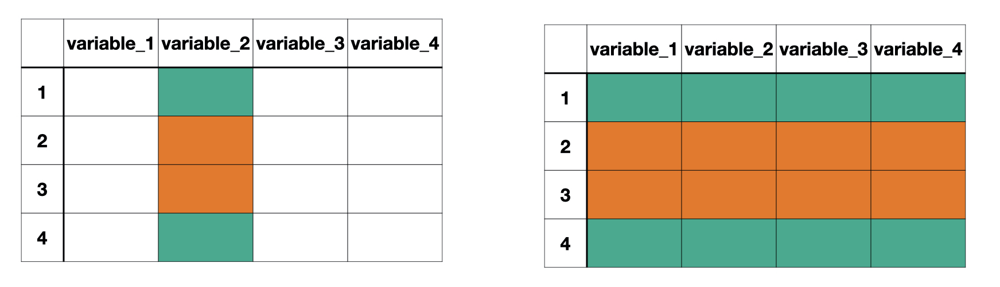
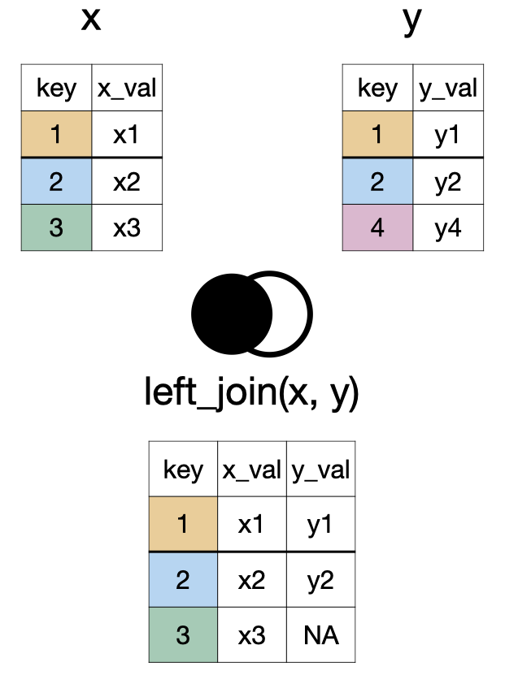
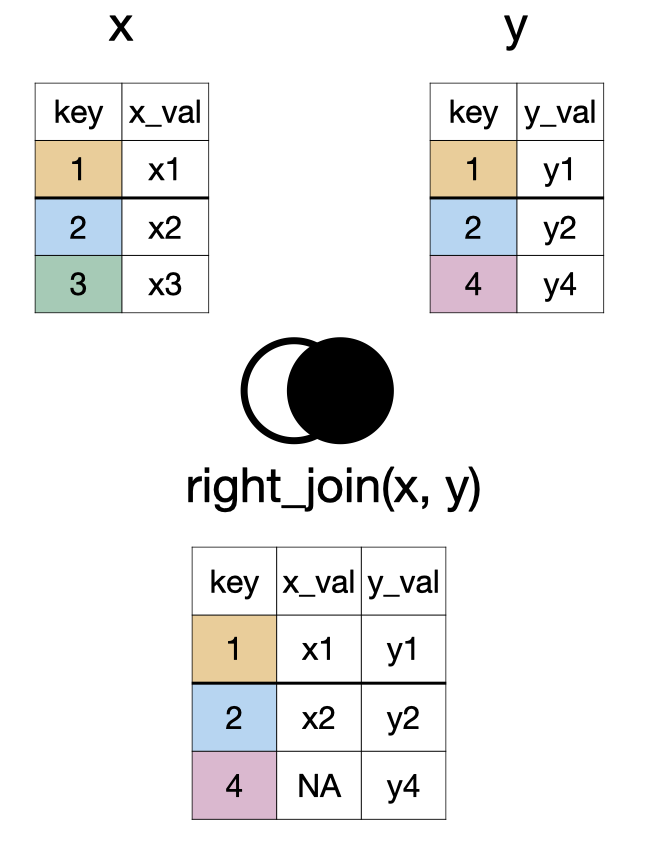
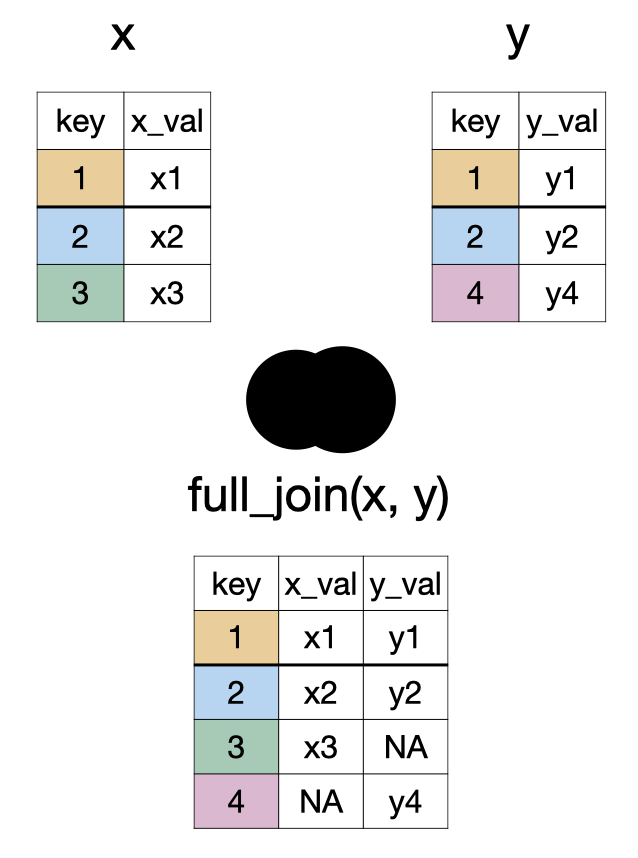
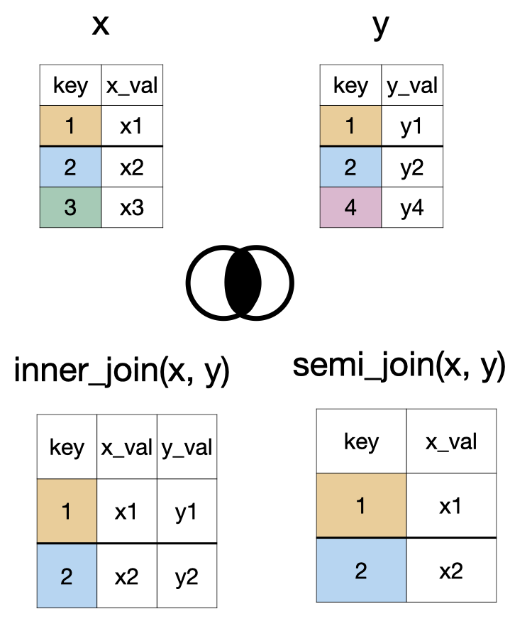
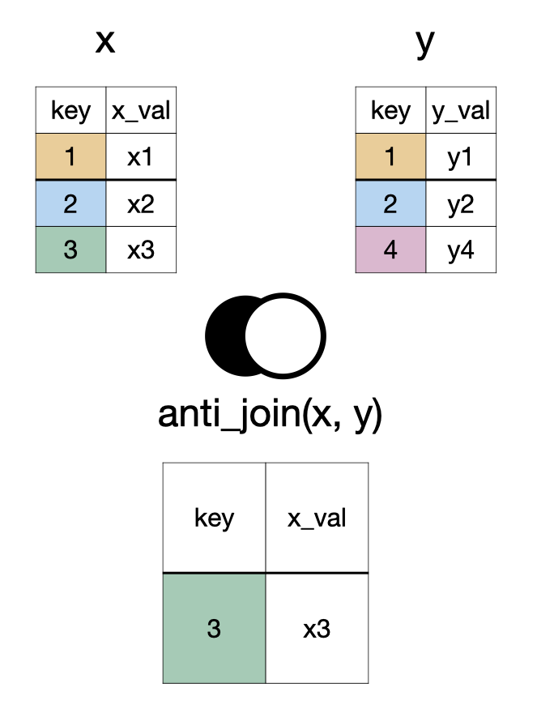
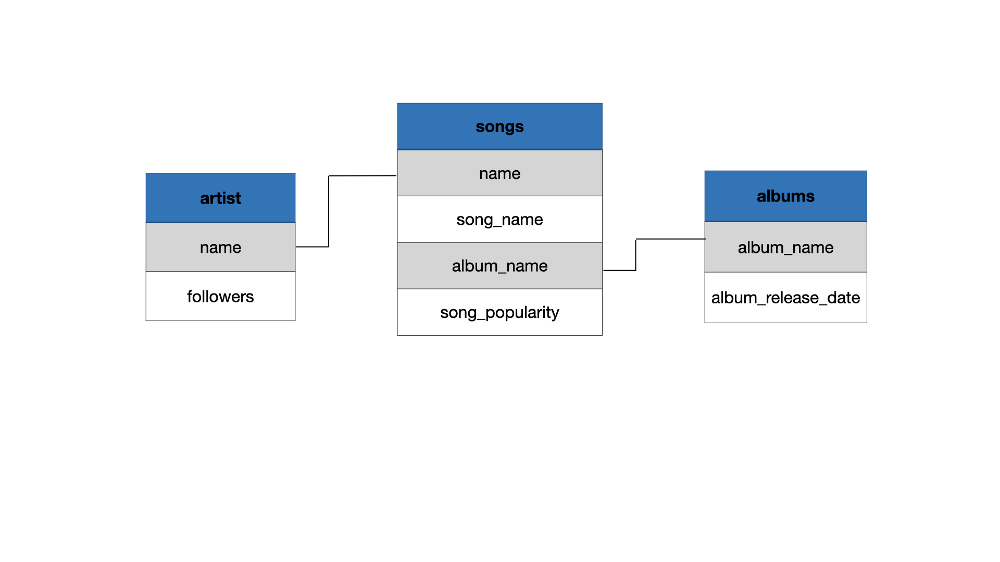

```{r}
#| echo: false
library(tidyverse)
library(janitor)
options(scipen = 999)
```


```{r}
#| echo: false
artists <- readxl::read_xlsx("../data/spotify.xlsx", sheet = "artist")
songs <- readxl::read_xlsx("../data/spotify.xlsx", sheet = "top_song")
albums <- readxl::read_xlsx("../data/spotify.xlsx", sheet = "album") |> 
  mutate(album_release_date = lubridate::ymd(album_release_date))
```

## Data

```{r}
library(medicaldata)
covid_data <- medicaldata::covid_testing
glimpse(covid_data)
```


# Aggregating Data


##

::::{.columns}
:::{.column width="50%"}
### Data
Observations
:::

:::{.column width="50%"}
### Aggregate Data
Summaries of observations
:::
::::

## Aggregating Categorical Data

Categorical data are summarized with **counts** or **proportions**.

##


```{r}
covid_data |> 
  count(result)
```

. . .

```{r}
covid_data |> 
  count(result) |> 
  mutate(prop = n/sum(n))
```

## Aggregating Numerical Data

Mean, median, standard deviation, variance, and quartiles are some of the numerical summaries of numerical variables.


```{r}
covid_data |> 
  mutate(report_delay = col_rec_tat + rec_ver_tat) |> 
  filter(report_delay <= 48) |> 
  summarize(mean_report_delay = mean(report_delay),
          sd_report_delay = sd(report_delay))
```

# Aggregating Data By Groups

## `group_by()`

We have used this function yesterday to aggregate data into daily counts of test results. Let's review and use this function for other types of groups.

```{r}
#| echo: false
#| fig-align: center

```

`group_by()` separates the data frame by the groups. Any action following `group_by()` will be completed for each group separately.

##

Q. What is the median test reporting delay for each clinic type?

## 

```{r}
covid_data |> 
  group_by(clinic_name)
```

##

Note that when `group_by()` is used there have been no changes to the number of columns or rows. 
The only difference we can observe is now `Groups: clinic_name [88]` is displayed indicating the data frame (i.e., tibble) is divided into 88 groups.

##

```{r}
covid_data |> 
  mutate(report_delay = col_rec_tat + rec_ver_tat) |> 
  filter(report_delay <= 48) |>
  group_by(result) |> 
  summarize(med_report_delay = median(report_delay))
```

##

We can also remind ourselves how many tests were performed in each clinic group.

```{r}
covid_data |> 
  group_by(clinic_name) |> 
  mutate(report_delay = col_rec_tat + rec_ver_tat) |> 
  filter(report_delay <= 48) |>
  summarize(med_report_delay = median(report_delay), count=n())
```

Note that `n()` does not take any arguments.


# Data Joins

## `left_join(x, y)`

```{r}
#| echo: false
#| fig-align: center

```

## `right_join(x, y)`


```{r}
#| echo: false
#| fig-align: center
#| out-width: 45% 

```

## `full_join(x, y)`


```{r}
#| echo: false
#| fig-align: center
#| out-width: 45% 

```

## `inner_join(x, y)` and `semi_join(x, y)`

```{r}
#| echo: false
#| fig-align: center
#| out-width: 45% 

```

## `anti_join(x, y)`

```{r}
#| echo: false
#| fig-align: center
#| out-width: 45% 

```

## `something_join(x, y)`


<table>
<thead>
  <tr>
    <th></th>
    <th colspan="2" style="text-align: center">x</th>
    <th colspan="2" style="text-align: center">y</th>
  </tr>
</thead>
<tbody>
  <tr>
    <td></td>
    <td>rows</td>
    <td>columns</td>
    <td>rows</td>
    <td>columns</td>
  </tr>
  <tr>
    <td>`left_join()`</td>
    <td>all</td>
    <td>all</td>
    <td>matched</td>
    <td>all</td>
  </tr>
  <tr>
    <td>`right_join()`</td>
    <td>matched</td>
    <td>all</td>
    <td>all</td>
    <td>all</td>
  </tr>
  <tr>
    <td>`full_join()`</td>
    <td>all</td>
    <td>all</td>
    <td>all</td>
    <td>all</td>
  </tr>
  <tr>
    <td>`inner_join()`</td>
    <td>matched</td>
    <td>all</td>
    <td>matched</td>
    <td>all</td>
  </tr>
  <tr>
    <td>`semi_join()`</td>
    <td>matched</td>
    <td>all</td>
    <td>none</td>
    <td>none</td>
  </tr>
  <tr>
    <td>`anti_join()`</td>
    <td>unmatched</td>
    <td>all</td>
    <td>none</td>
    <td>none</td>
  </tr>
</tbody>
</table>

## 

::: {.panel-tabset}

## artists

```{r}
artists
```

## songs

```{r}
songs
```

## albums

```{r}
albums
```


:::
##

```{r}
#| echo: false
#| fig-align: center

```

## 

```{r}
left_join(songs, artists)
```

## 

```{r}
right_join(songs, artists)
```


##

```{r}
full_join(songs, artists, by = "name")
```

##

```{r}
full_join(songs, artists, by = "name") |> 
  full_join(albums, by = "album_name")
```


- Download cases/tests/deaths data from [CA Open Data Portal](https://data.ca.gov/dataset/covid-19-time-series-metrics-by-county-and-state-archived/resource/246e823b-4ce9-4258-a3cd-88aecd8744de).


- Load this new data into R/RStudio using `read_csv()` function

- What format do dates in both hospitalization and cases/tests/deaths tibbles follow? Let's make sure that they are of `Date` type

- Join the two datasets by date and county

- Plot the time series of hospitalization-to-cases ratio in Orange county during 2020-2024 on the days when both metrics are available