## Naming files

::: {.nonincremental}

Three principles of naming files 

- machine readable
- human readable
- plays well with default ordering (e.g. alphabetical and numerical ordering)

(Jenny Bryan)


:::

## README.md

- README file is the first file users read. In our case a user might be our future self, a teammate, or (if open source) anyone.


- There can be multiple README files within a single directory: e.g. for the general project folder and then for a data subfolder. Data folder README's can possibly contain codebook (data dictionary).


- It should be brief but detailed enough to help user navigate. 

##

- a README should be up-to-date (can be updated throughout a project's lifecycle as needed).


- On GitHub we use markdown for README file (`README.md`). Good news: [emojis are supported.](https://gist.github.com/rxaviers/7360908)


## README examples

- [STATS 6 website](https://github.com/stats6-sp26/website)
- [Minin's group meetings](https://github.com/vnminin/stoch_mod_journal_club)
- [Research paper code](https://github.com/CatalinaMedina/reporting-delays-in-phylodynamics-paper)

## Collaboration on GitHub

```{r}
#| echo: false
#| out-width: "90%"

```

## Collaboration on GitHub


```{r}
#| echo: false
#| out-width: "90%"
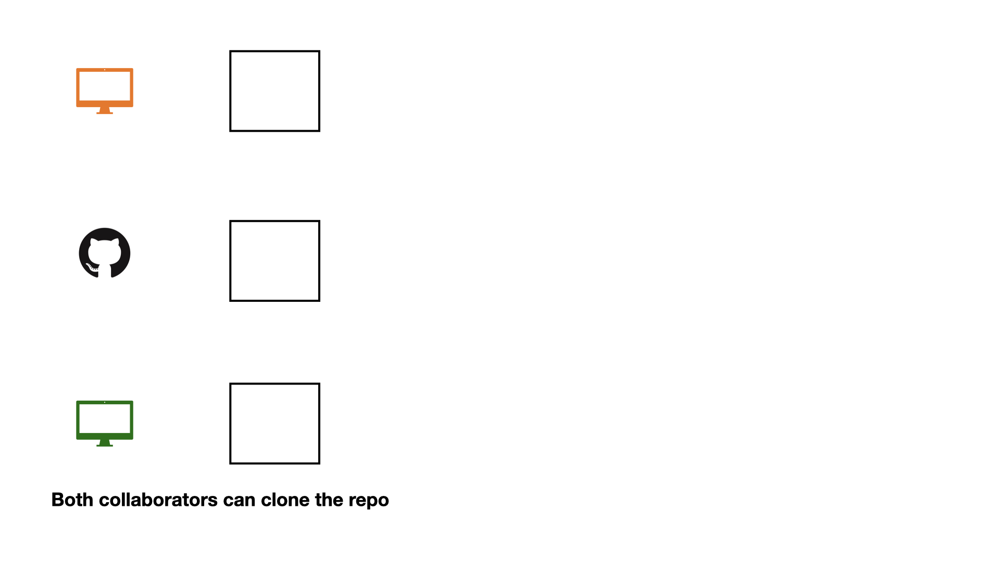
```

## Collaboration on GitHub


```{r}
#| echo: false
#| out-width: "90%"
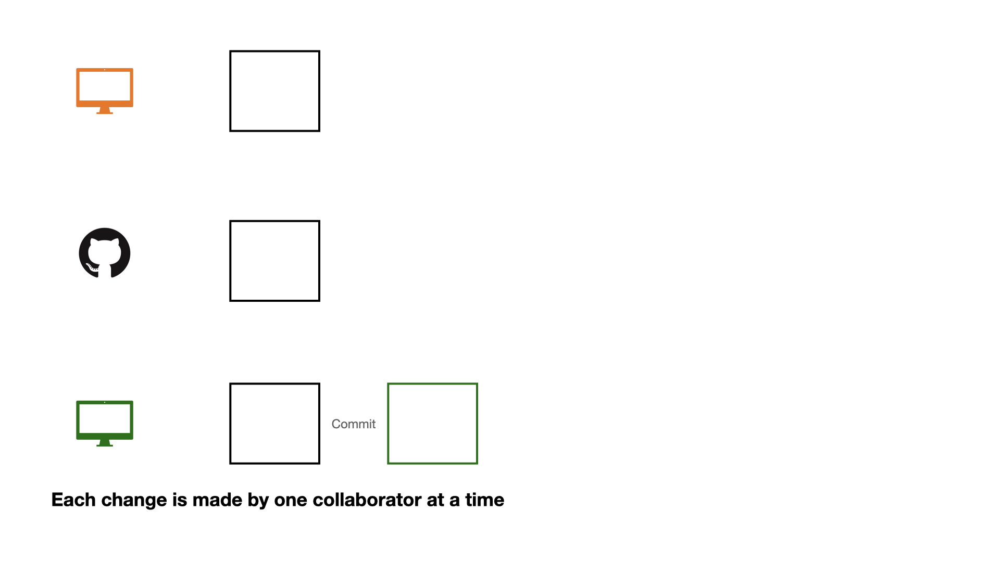
```

## Collaboration on GitHub


```{r}
#| echo: false
#| out-width: "90%"
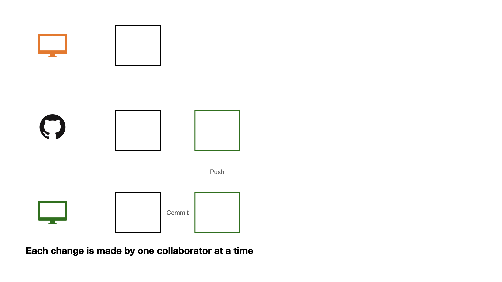
```

## Collaboration on GitHub


```{r}
#| echo: false
#| out-width: "90%"
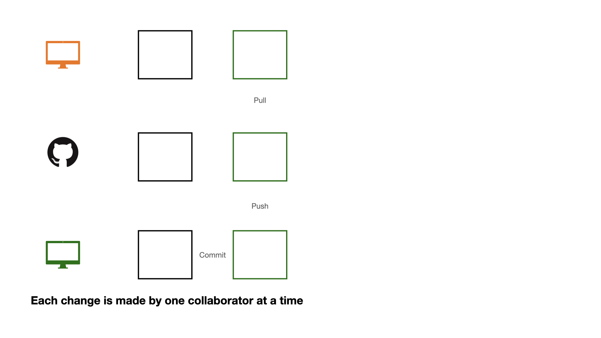
```

## Collaboration on GitHub

```{r}
#| echo: false
#| out-width: "90%"
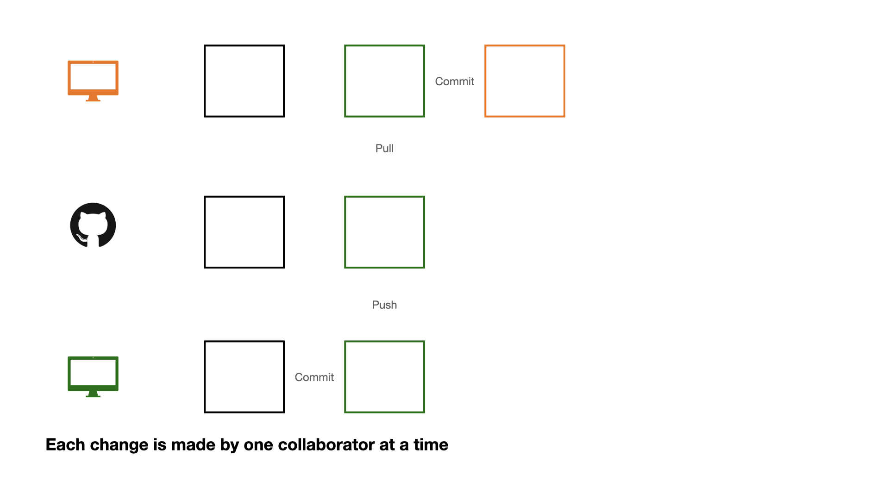
```

## Collaboration on GitHub


```{r}
#| echo: false
#| out-width: "90%"
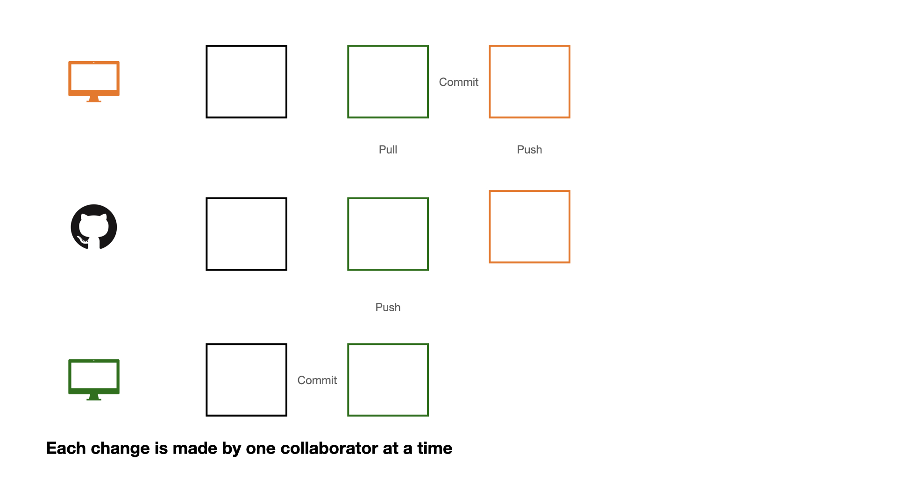
```

## Collaboration on GitHub

If each change is made by one collaborator at a time, this would not be an efficient workflow. 

## Collaboration on GitHub


```{r}
#| echo: false
#| out-width: "90%"
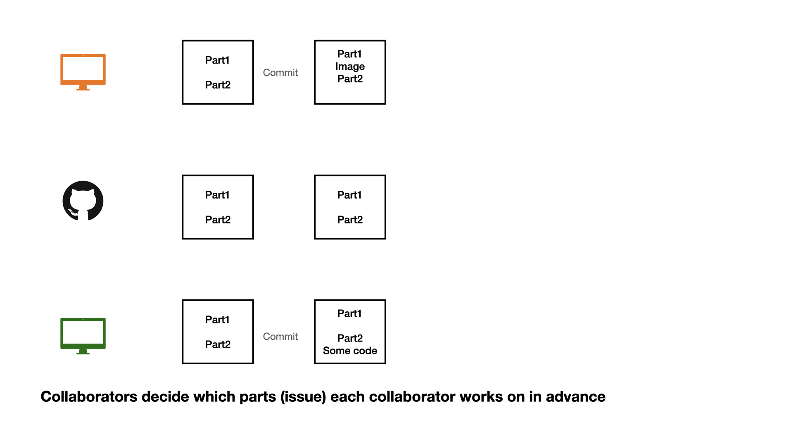
```

## Collaboration on GitHub


```{r}
#| echo: false
#| out-width: "90%"
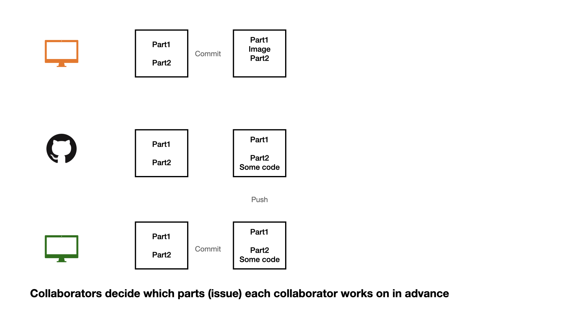
```

## Collaboration on GitHub

```{r}
#| echo: false
#| out-width: "90%"
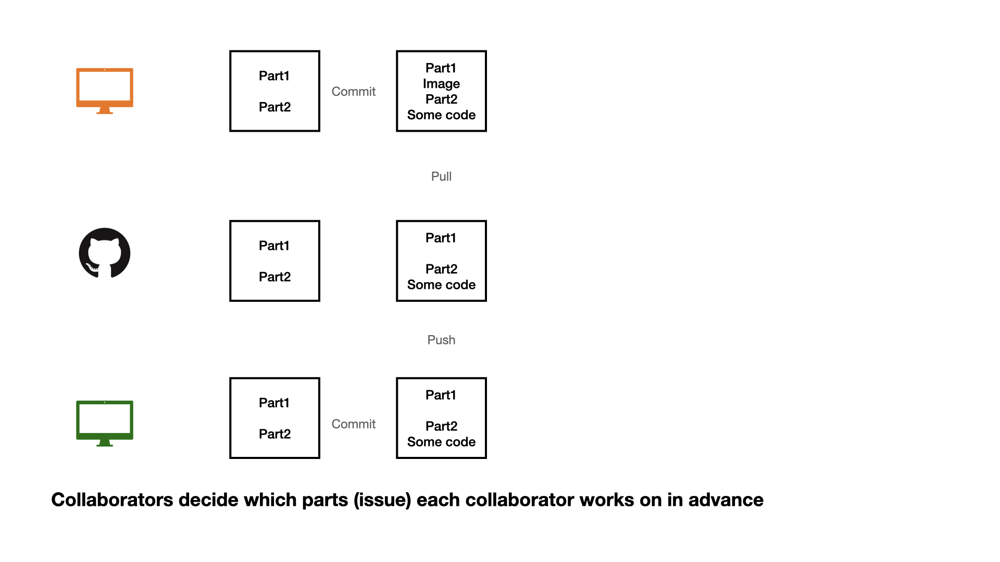
```

## Collaboration on GitHub

1 - commit

2 - pull (very important)

3 - push


## Collaboration on GitHub


```{r}
#| echo: false
#| out-width: "90%"
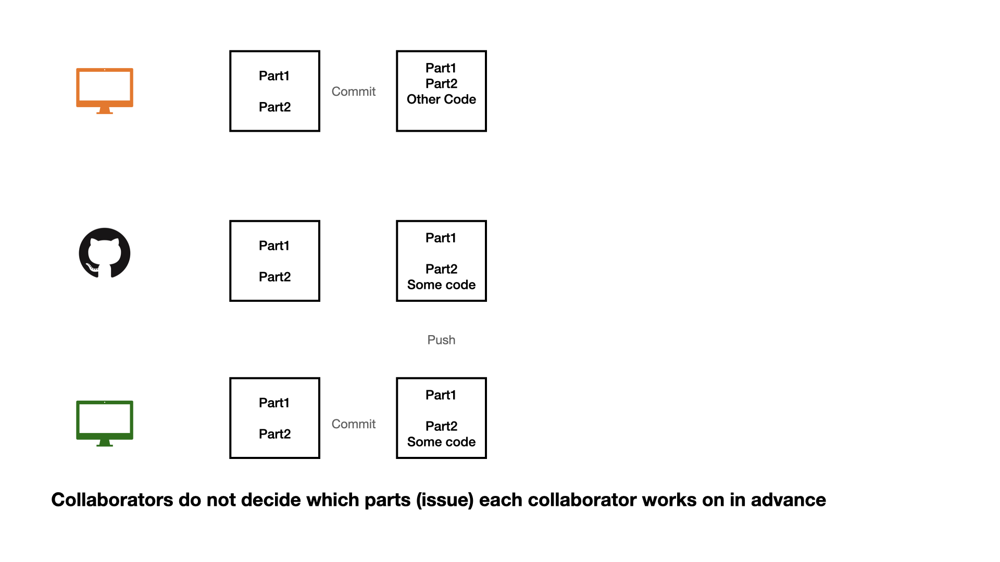
```


## Collaboration on GitHub


```{r}
#| echo: false
#| out-width: "90%"
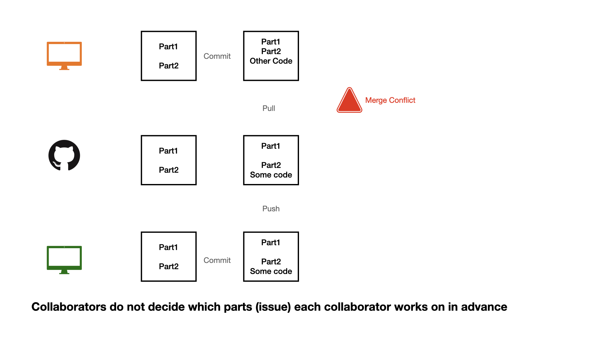
```


## Collaboration on GitHub


```{r}
#| echo: false
#| out-width: "90%"
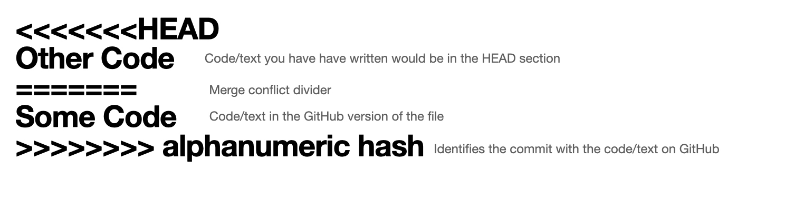
```


## Opening an issue

```{r}
#| echo: false
#| out-width: "90%"
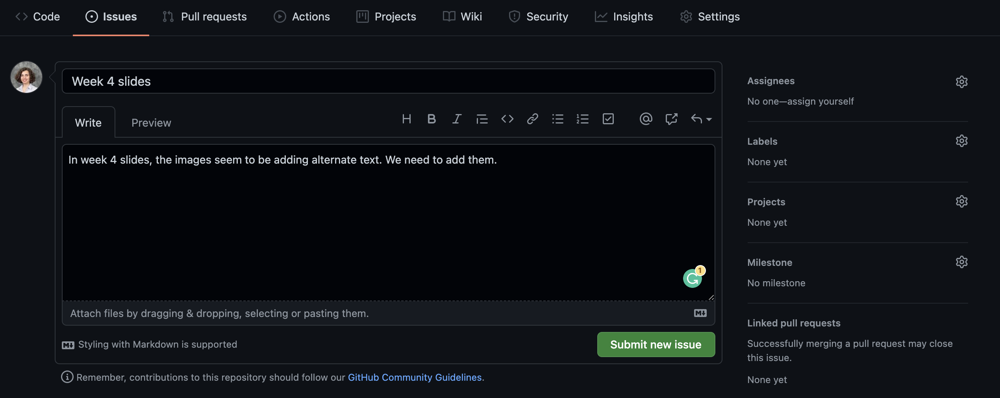
```

We can create an **issue** to keep a list of mistakes to be fixed, ideas to check with teammates, or note a to-do task. You can assign tasks to yourself or teammates. 

## Closing an issue

```{r}
#| echo: false
#| out-width: "90%"
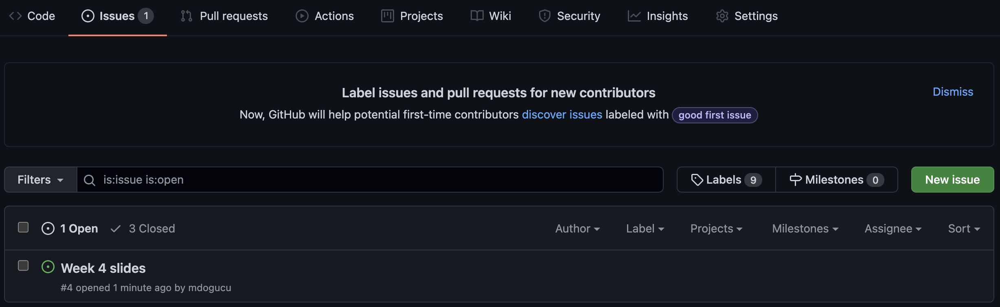
```

If you are working on an issue, it makes sense to refer to issue number in your commit message (e.g. "add first draft of alternate texts for #4"). 
If your commit resolves the issue then you can use key words such as "fixes #4" or "closes #4" to close the issue. 
Issues can also be manually closed.

## .gitignore

A .gitignore file contains the list of files which Git has been explicitly told to ignore.

For instance README.html can be git ignored.

You may consider git ignoring confidential files (e.g. some datasets) so that they would not be pushed by mistake to GitHub.

A file can be git ignored either by point-and-click using RStudio's Git pane or by adding the file path to the .gitignore file. For instance weather.csv data file in a data folder need to be added as data/weather.csv

Files with certain files (e.g. all .log files) can also be ignored. See git ignore patterns.

## Project directory structure example

- data
  + raw
  + processed
- code
  + R
  + quarto
- output
  + text_files
  + plots


##

*Your task*:

- Form a group of 2-3 people (your desk group)

- Choose one person to create a GitHub repository, to create an R project from this repo, and add their team member(s) as collaborator(s)

- The other team member(s) should create an R project from this repo too

## 

*Your task*:
- Perform the following collaboration tasks:
  + One team member creates a `data` directory, adds California hospitalization and cases/tests/deaths files into this directory, and pushes these changes via git
  + The other team member(s) pulls to get the data
  + Another team member adds some analysis code in the code directory
  + Now work on some changes in the code and `commit->pull->push` your changes via git
  + Collaborate on the `Readme.md` file


