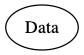
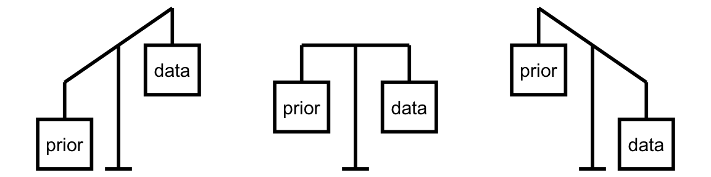

```{r}
#| echo: false
library(bayesrules)
```

## What is Bayesian Statistics?

Think 💭 - Pair 👫🏽 - Share 💬

What have you so far heard about Bayesian Statistics?

## What does a p-value represent?

Think 💭 - Pair 👫🏽 - Share 💬

## Why should you learn Bayesian Statistics?

## An example

"In 1985 only about 10% of JASA [Journal of the American Statistical Association] Applications and Case Studies articles used Bayesian methods.

. . .

In 2022 plus half of 2023, that percentage has changed.
It is now 49%."


Jeff Witmer, _To Bayes or Not to Bayes --
Is There Any Question?_ Talk at Joint Statistical Meetings, 2023

## Why should you learn Bayesian Statistics?

- intuitive

. . .

- draws a more complete picture of statistics from both philosophical and application perspectives

. . .

- prepares you for your future career

. . . 

- statistics and computing are used in a harmonious way


# Introduction to Bayesian Ideas

The notes for this lecture are derived from  [Chapter 1 of the Bayes Rules! book](https://www.bayesrulesbook.com/chapter-1)

##

> How can we live if we don't change?  
Beyoncé


## Bayesian Knowledge Building

```{r}
#| echo: false
#| fig-align: center
knitr::include_graphics("img/bayes_diagram.png")
```

## Frequentist Knowledge Building

```{r}
#| echo: false
#| fig-align: center
#| fig-width: 4

```

## Balancing Act of Bayesian Analysis

```{r}
#| echo: false
#| fig-align: center

```

## Interpretation of Probability

**Bayesian**: a probability measures the relative plausibility of an event.

**Frequentist**: a probability measures the long-run relative frequency of a repeatable event. In fact, “frequentists” are so named because of their interpretation of probability as a long-run relative frequency.


## Prior Data

Consider two claims. (1) Zuofu claims that he can predict the outcome of a coin flip. To test his claim, you flip a fair coin 10 times and he correctly predicts all 10! 

(2) Kavya claims that she can distinguish natural and artificial sweeteners. To test her claim, you give her 10 sweetener samples and she correctly identifies each! In light of these experiments, what do you conclude?

a. You’re more confident in Kavya’s claim than Zuofu’s claim.

b. The evidence supporting Zuofu’s claim is just as strong as the evidence supporting Kavya’s claim.


## Hypothesis Testing

Suppose that during a recent doctor’s visit, you tested positive for a very rare disease. If you only get to ask the doctor one question, which would it be?

a. What’s the chance that I actually have the disease?  
b. If in fact I don’t have the disease, what’s the chance that I would’ve gotten this positive test result?

. . .

a. $P(disease | +)$  
b. $P(+ | disease^c)$


## Notes on Bayesian History

- Named after Thomas Bayes (1701-1761).

. . .

- Frequentist statistics has been more popular historically and Bayesian statistics is starting to get popular, mainly because 

. . .

- Computing, computing, computing.

. . .

- It is harder to adopt to newer methods. Thus change is happening slowly. 

. . .

- We can embrace subjectivity. 


## Optional

Watch [How Data Nerds Found A 131-Year-Old Sunken Treasure](https://fivethirtyeight.com/features/how-data-nerds-found-a-131-year-old-sunken-treasure/)


# Probability Review

##
<style type="text/css">
.tg  {border-collapse:collapse;border-spacing:0;}
.tg td{font-family:Arial, sans-serif;font-size:14px;padding:10px 5px;border-style:solid;border-width:1px;overflow:hidden;word-break:normal;border-color:black;}
.tg th{font-family:Arial, sans-serif;font-size:14px;font-weight:normal;padding:10px 5px;border-style:solid;border-width:1px;overflow:hidden;word-break:normal;border-color:black;}
.tg .tg-x5q1{font-size:16px;text-align:left;vertical-align:top}
.tg .tg-vox4{font-weight:bold;font-size:16px;text-align:left;vertical-align:top}
.tg .tg-cqfb{font-size:16px;text-align:left;vertical-align:middle}
</style>
<table class="tg" align="center">
  <tr>
    <th class="tg-x5q1"></th>
    <th class="tg-x5q1" colspan="2">Belief in afterlife</th>
    <th class="tg-x5q1"></th>
  </tr>
  <tr>
    <td class="tg-cqfb">Taken a college science class</td>
    <td class="tg-cqfb">Yes</td>
    <td class="tg-cqfb">No</td>
    <td class="tg-vox4">Total</td>
  </tr>
  <tr>
    <td class="tg-cqfb">Yes</td>
    <td class="tg-cqfb">2702</td>
    <td class="tg-cqfb">634</td>
    <td class="tg-vox4"><span style="font-weight:700">3336</span></td>
  </tr>
  <tr>
    <td class="tg-cqfb">No</td>
    <td class="tg-cqfb">3722</td>
    <td class="tg-cqfb">837</td>
    <td class="tg-vox4"><span style="font-weight:700">4559</span></td>
  </tr>
  <tr>
    <td class="tg-vox4">Total</td>
    <td class="tg-vox4">6424</td>
    <td class="tg-vox4"><span style="font-weight:bold">1471</span></td>
    <td class="tg-vox4">7895</td>
  </tr>
</table>


<p style="font-size: small">
Data from <a href ="https://gssdataexplorer.norc.org"> General Social Survey</a>
</p>

$P(\text{belief in afterlife})$ = ?
$P(\text{belief in afterlife and taken a college science class})$ = ?  
$P(\text{belief in afterlife given taken a college science class})$ = ?

Calculate these probabilities and write them using correct notation. Use $A$ for belief in afterlife and $B$ for college science class.


## Marginal Probability 

<style type="text/css">
.tg  {border-collapse:collapse;border-spacing:0;}
.tg td{font-family:Arial, sans-serif;font-size:14px;padding:10px 5px;border-style:solid;border-width:1px;overflow:hidden;word-break:normal;border-color:black;}
.tg th{font-family:Arial, sans-serif;font-size:14px;font-weight:normal;padding:10px 5px;border-style:solid;border-width:1px;overflow:hidden;word-break:normal;border-color:black;}
.tg .tg-x5q1{font-size:16px;text-align:left;vertical-align:top}
.tg .tg-vox4{font-weight:bold;font-size:16px;text-align:left;vertical-align:top}
.tg .tg-cqfb{font-size:16px;text-align:left;vertical-align:middle}
</style>
<table class="tg" align="center">
  <tr>
    <th class="tg-x5q1"></th>
    <th class="tg-x5q1" colspan="2">Belief in afterlife</th>
    <th class="tg-x5q1"></th>
  </tr>
  <tr>
    <td class="tg-cqfb">Taken a college science class</td>
    <td class="tg-cqfb">Yes</td>
    <td class="tg-cqfb">No</td>
    <td class="tg-vox4">Total</td>
  </tr>
  <tr>
    <td class="tg-cqfb">Yes</td>
    <td class="tg-cqfb">2702</td>
    <td class="tg-cqfb">634</td>
    <td class="tg-vox4"><span style="font-weight:700">3336</span></td>
  </tr>
  <tr>
    <td class="tg-cqfb">No</td>
    <td class="tg-cqfb">3722</td>
    <td class="tg-cqfb">837</td>
    <td class="tg-vox4"><span style="font-weight:700">4559</span></td>
  </tr>
  <tr>
    <td class="tg-vox4">Total</td>
    <td class="tg-vox4">6424</td>
    <td class="tg-vox4"><span style="font-weight:bold">1471</span></td>
    <td class="tg-vox4">7895</td>
  </tr>
</table>


<p style="font-size: small">
Data from <a href ="https://gssdataexplorer.norc.org"> General Social Survey</a>
</p>

$P(\text{belief in afterlife})$ = ?  
$P(A) = \frac{6424}{7895}$

. . .

$P(A)$ represents a __marginal probability__. So do $P(B)$, $P(A^C)$ and $P(B^C)$. In order to calculate these probabilities we could only use the values in the margins of the contingency table, hence the name. 


## Joint Probability 

<style type="text/css">
.tg  {border-collapse:collapse;border-spacing:0;}
.tg td{font-family:Arial, sans-serif;font-size:14px;padding:10px 5px;border-style:solid;border-width:1px;overflow:hidden;word-break:normal;border-color:black;}
.tg th{font-family:Arial, sans-serif;font-size:14px;font-weight:normal;padding:10px 5px;border-style:solid;border-width:1px;overflow:hidden;word-break:normal;border-color:black;}
.tg .tg-x5q1{font-size:16px;text-align:left;vertical-align:top}
.tg .tg-vox4{font-weight:bold;font-size:16px;text-align:left;vertical-align:top}
.tg .tg-cqfb{font-size:16px;text-align:left;vertical-align:middle}
</style>
<table class="tg" align="center">
  <tr>
    <th class="tg-x5q1"></th>
    <th class="tg-x5q1" colspan="2">Belief in afterlife</th>
    <th class="tg-x5q1"></th>
  </tr>
  <tr>
    <td class="tg-cqfb">Taken a college science class</td>
    <td class="tg-cqfb">Yes</td>
    <td class="tg-cqfb">No</td>
    <td class="tg-vox4">Total</td>
  </tr>
  <tr>
    <td class="tg-cqfb">Yes</td>
    <td class="tg-cqfb">2702</td>
    <td class="tg-cqfb">634</td>
    <td class="tg-vox4"><span style="font-weight:700">3336</span></td>
  </tr>
  <tr>
    <td class="tg-cqfb">No</td>
    <td class="tg-cqfb">3722</td>
    <td class="tg-cqfb">837</td>
    <td class="tg-vox4"><span style="font-weight:700">4559</span></td>
  </tr>
  <tr>
    <td class="tg-vox4">Total</td>
    <td class="tg-vox4">6424</td>
    <td class="tg-vox4"><span style="font-weight:bold">1471</span></td>
    <td class="tg-vox4">7895</td>
  </tr>
</table>


<p style="font-size: small">
Data from <a href ="https://gssdataexplorer.norc.org"> General Social Survey</a>
</p>

$P(\text{belief in afterlife and taken a college science class})$ = ? 
$P(A \text{ and } B) = P(A \cap B) = \frac{2702}{7895}$

. . .

$P(A \cap B)$ represents a __joint probability__. So do $P(A^c \cap B)$, $P(A\cap B^c)$ and $P(A^c\cap B^c)$. 

. . .

Note that $P(A\cap B) = P(B\cap A)$. Order does _not_ matter.


## Conditional Probability 

<style type="text/css">
.tg  {border-collapse:collapse;border-spacing:0;}
.tg td{font-family:Arial, sans-serif;font-size:14px;padding:10px 5px;border-style:solid;border-width:1px;overflow:hidden;word-break:normal;border-color:black;}
.tg th{font-family:Arial, sans-serif;font-size:14px;font-weight:normal;padding:10px 5px;border-style:solid;border-width:1px;overflow:hidden;word-break:normal;border-color:black;}
.tg .tg-x5q1{font-size:16px;text-align:left;vertical-align:top}
.tg .tg-vox4{font-weight:bold;font-size:16px;text-align:left;vertical-align:top}
.tg .tg-cqfb{font-size:16px;text-align:left;vertical-align:middle}
</style>
<table class="tg" align="center">
  <tr>
    <th class="tg-x5q1"></th>
    <th class="tg-x5q1" colspan="2">Belief in afterlife</th>
    <th class="tg-x5q1"></th>
  </tr>
  <tr>
    <td class="tg-cqfb">Taken a college science class</td>
    <td class="tg-cqfb">Yes</td>
    <td class="tg-cqfb">No</td>
    <td class="tg-vox4">Total</td>
  </tr>
  <tr>
    <td class="tg-cqfb">Yes</td>
    <td class="tg-cqfb">2702</td>
    <td class="tg-cqfb">634</td>
    <td class="tg-vox4"><span style="font-weight:700">3336</span></td>
  </tr>
  <tr>
    <td class="tg-cqfb">No</td>
    <td class="tg-cqfb">3722</td>
    <td class="tg-cqfb">837</td>
    <td class="tg-vox4"><span style="font-weight:700">4559</span></td>
  </tr>
  <tr>
    <td class="tg-vox4">Total</td>
    <td class="tg-vox4">6424</td>
    <td class="tg-vox4"><span style="font-weight:bold">1471</span></td>
    <td class="tg-vox4">7895</td>
  </tr>
</table>


<p style="font-size: small">
Data from <a href ="https://gssdataexplorer.norc.org"> General Social Survey</a>
</p>

$P(\text{belief in afterlife given taken a college science class})$ = ?
$P(A \text{ given } B) = P(A | B) = \frac{2702}{3336}$

. . .

$P(A|B)$ represents a __conditional probability__. So do $P(A^c|B)$, $P(A | B^c)$ and $P(A^c|B^c)$. In order to calculate these probabilities we would focus on the row or the column of the given information. In a way we are _reducing_ our sample space to this given information only. 


## Note on conditional probability

$P(\text{attending every class | getting an A}) \neq$ $P(\text{getting an A | attending every class})$

The order matters!


## Complement of an Event

$P(A^C)$ is called __complement__ of event A and represents the probability of selecting someone that does not believe in afterlife.  

# Bayes' Rule for Events

The notes for this lecture are derived from  [Section 2.1 of the Bayes Rules! book](https://www.bayesrulesbook.com/chapter-2#building-a-bayesian-model-for-events)

## Spam email

Priya, a data science student, notices that her college's email server is using a faulty spam filter.  Taking matters into her own hands, Priya decides to build her own spam filter.  As a first step, she manually examines all emails she received during the previous month and determines that 40% of these were spam.  


## Prior 

Let event B represent an event of an email being spam.

$P(B) = 0.40$

If Priya was to act on this prior what should she do about incoming emails?


## A possible solution

Since most email is non-spam, sort all emails into the inbox.  

This filter would certainly solve the problem of losing non-spam email in the spam folder, but at the cost of making a mess in Priya's inbox.  


## Data

Priya realizes that some emails are written in all capital letters ("all caps") and decides to look at some data. In her one-month email collection, 20% of spam but only 5% of non-spam emails used all caps. 

. . .

Using notation:

$P(A|B) = 0.20$

$P(A|B^c) = 0.05$

##

<center>

```{r priya, echo = FALSE, fig.align='center', message = FALSE, warning = FALSE}
library(DiagrammeR)
library(tidyverse)
grViz(diagram = "
    digraph {
        # graph aesthetics
        graph [ranksep = 0.5]
        # node definitions with substituted label text
        1 [label = 'Prior: \n Only 40% of emails are spam.']
        2 [label = 'Data: \n All caps is more common among spam.']
        3 [label = 'Posterior: \n Is the email spam or not?!']
        # edge definitions with the node IDs
        1 -> 3
        2 -> 3
    }
")
```

</center>

##

Which of the following best describes your posterior understanding of whether the email is spam?


a. The chance that this email is spam drops from 40% to 20%.  After all, the subject line might indicate that the email was sent by an excited professor that's offering Priya an automatic "A" in their course!  
b. The chance that this email is spam jumps from 40% to roughly 70%.  Though using all caps is more common among spam emails, let's not forget that only 40% of Priya's emails are spam.  
c. The chance that this email is spam jumps from 40% to roughly 95%.  Given that so few non-spam emails use all caps, this email is almost certainly spam.


## The prior model

<div align="center">

| event       | $B$ | $B^c$ | Total |
|-------------|-----|-------|-------|
| probability | 0.4 | 0.6   | 1     |


</div>

## Likelihood

Looking at the conditional probabilities

$P(A|B) = 0.20$

$P(A|B^c) = 0.05$

we can conclude that all caps is more common among spam emails than non-spam emails. Thus, the email is more **likely** to be spam. 

Consider likelihoods $L(.|A)$:

$L(B|A) := P(A|B)$ and $L(B^c|A) := P(A|B^c)$

 
## Probability vs likelihood   

When $B$ is known, the __conditional probability function__ $P(\cdot | B)$ allows us to compare the probabilities of an unknown event, $A$ or $A^c$, occurring with $B$: 

$$P(A|B) \; \text{ vs } \; P(A^c|B) \; .$$  

When $A$ is known, the __likelihood function__ $L( \cdot | A) := P(A | \cdot)$ allows us to compare the likelihoods of different unknown scenarios, $B$ or $B^c$, producing data $A$:

$$L(B|A) \; \text{ vs } \; L(B^c|A) \; .$$

## 

Thus the likelihood function provides the tool we need to evaluate the relative compatibility of events $B$ or $B^c$ with data $A$. 


## The posterior model

$P(B|A) = \frac{P(A\cap B)}{P(A)}$

. . .

$P(B|A) = \frac{P(B)P(A|B)}{P(A)}$

. . .

$P(B|A) = \frac{P(B)L(B|A)}{P(A)}$

. . .

Recall Law of Total Probability,     

$P(A) = P(A\cap B) + P(A\cap B^c)$

. . .

$P(A) = P(A|B)P(B) + P(A|B^c)P(B^c)$


##


:::: {.columns}

::: {.column width="70%"}
$P(B|A) = \frac{P(B)L(B|A)}{P(A|B) P(B)+P(A|B^c) P(B^c)}$
:::

::: {.column width="30%"}
$P(B) = 0.40$

$P(A|B) = 0.20$

$P(A|B^c) = 0.05$
:::

::::


. . .

$P(B|A) = \frac{0.40 \cdot 0.20}{(0.20 \cdot 0.40) + (0.05 \cdot 0.60)}$


## The Posterior Model

<div align="center">

| event                 | $B$  | $B^c$ | Total |
|-----------------------|------|-------|-------|
| prior probability     | 0.4  | 0.6   | 1     |
| posterior probability | 0.72 | 0.18  | 1     |

</div>


## Likelihood is not a probability distribution

<div align="center">

| event                 | $B$  | $B^c$ | Total |
|-----------------------|------|-------|-------|
| prior probability     | 0.4  | 0.6   | 1     |
| likelihood            | 0.20 | 0.05  | 0.25  |
| posterior probability | 0.72 | 0.18  | 1     |

</div>

# Summary

$$P(B |A) = \frac{P(B)L(B|A)}{P(A)}$$

. . .

$$\text{posterior} = \frac{\text{prior}\cdot\text{likelihood}}{\text{marginal probability}}$$

. . .

$$\text{posterior} = \frac{\text{prior}\cdot\text{likelihood}}{\text{normalizing constant}}$$
