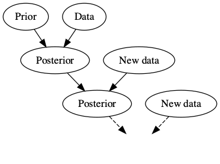

```{r}
#| echo: false
library(DiagrammeR)
library(DiagrammeRsvg)
library(rsvg)
```


## Why should you learn Bayesian Statistics?

Statistical methods are mainly inspired by real-life scientific problems.

. . .

The overall goal of statistical analysis is to provide a robust framework to understand unknown phenomena, answer scientific questions, and make decisions. 

. . .

To this end, we rely on the observed data as well as our _domain knowledge_.

. . .

Bayesian statistics provides a principled framework for incorporating our domain knowledge in the data analysis.


## Domain knowledge

Our domain knowledge, which we refer to as \emph{prior} information, is mainly based on previous empirical evidence. 

. . . 

For example, if we are interested in the average normal body temperature, we would of course measure body temperature of a sample of subjects from the population, but we also know, based on previous data, that this average is a number close to $98.6\,^{\circ}\mathrm{F}$.

. . . 

In this case, our prior knowledge asserts that values around 98 are more plausible compared to values around 90 or 110. 


## Bayesian Knowledge Building

```{r}
#| echo: false
#| fig-align: center

```


## Objective vs. subjective

We could of course attempt to minimize our reliance on prior information.

. . . 

Most frequentist methods adhere to this principle, leveraging domain knowledge to determine which population characteristics are relevant to the scientific problem at hand. 

. . . 

While frequentist methods typically avoid incorporating priors when making inferences, it is important to recognize that this does not imply frequentist methods are entirely objective.


## Easy to understand, hard to implement


Bayesian methods on the other hand provide a mathematical framework to incorporate prior (domain) knowledge in the process of making inference. 

. . . 

This is based on the philosophy that if the prior is in fact informative, this should lead to more accurate inference and better decisions. 

. . . 

Additionally, Bayesians believe that incorporating our prior knowledge in the analysis should be explicit. 


## Easy to understand, hard to implement

While Bayesian methods provide a coherent and robust framework for statistical inference, they require a careful specification of models and priors. 

. . . 

Additionally, you need strong computational skills to implement them. 


. . . 

Therefore, while the underlying concept for Bayesian statistics is quite simple, implementing Bayesian methods might be more difficult compared to their frequentist counterparts.  


## Probability: It's personal!

In the Bayesian paradigm, probability is a measure of uncertainty. 

  - ``Coins don't have probabilities, people have probabilities'', Persi Diaconis. 

  - ``The only relevant thing is uncertainty--the extent of our own knowledge and
  ignorance,'' Bruno deFinetti. 


## Probability: It's personal!

In this view, all that matters is uncertainty, and all uncertainties are expressed in terms of probability: 

. . . 

  - random variables that change, or
  
  - parameters that might be assumed fixed (e.g., the population mean) but we are uncertain about their value.


## Probability: It's personal!


Consider the well-known coin tossing example. What is the probability of heads in one toss? 

. . . 

There are only two possibilities for the outcome: heads and tails. Assuming symmetry (i.e., a fair coin), heads and tails equal probability 1/2.

. . . 

In the frequentist view, probability is assigned to an event by regarding it as a class of individual events (i.e., trials) all equally probable and stochastically independent: 
  
  - assuming _iid_ tosses, the probability of heads is 1/2 since the relative frequency of heads reaches 1/2 as the number of trials grows. 

## Probability: It's personal!

Note that while Bayesians and frequentists provide the same answer, there is a fundamental and philosophical difference in how they view probability.

. . . 

Bayesians feel comfortable to assign probabilities to events that are not repeatable. 

. . . 

For example: what is Cabo Verde's probability of winning the World Cup this year (their first-ever FIFA World Cup appearance). 


## It's all about making decisions

Gelman and Nolan (2002) proposed the following experiment.

. . . 

I am going to keep tossing a coin and you are going to guess the outcome, you would win \$1 every time you guess "heads" and the outcome is "heads". What would be your strategy? 

. . . 

Would you change your strategy if I tell you the coin is not a fair coin and the probability of heads is only 0.1?

## It's all about making decisions

It is clear that to make decisions, we need more than just probability: we need a measure of loss or gain for each possible outcome.

. . . 

For this, we usually use a \emph{loss function} that assigns to each possible outcome a number that represents the cost and the amount of regret (e.g., loss of profit) we endure when that outcome occurs.

. . . 

Decision theory plays a key role in Bayesian statistical inference. 


