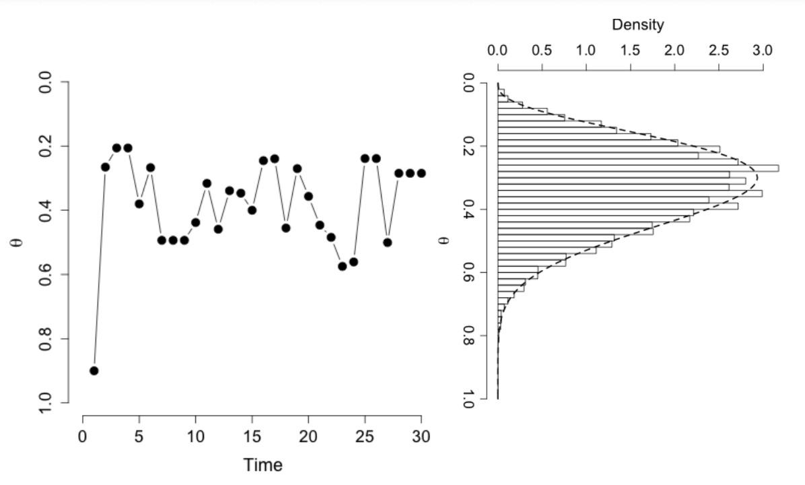

## Background

- We saw previously that in certain situations, the posterior distribution has a
  closed form (e.g., when the prior is conjugate), and the integrals are tractable.

- For many other problems, however, finding the posterior distribution and
  obtaining the expectation are far from trivial.

- Remember that even for the case of simple normal distribution with two
  parameters the posterior didn't have a closed form.

- In this lecture, we focus on problems where the posterior distribution is not
  analytically tractable.


## Monte Carlo Methods: A General Framework

- Assume that we are interested in finding integrals of the form
  $I = \int_a^b h(x)\,dx$.

- If we can draw iid samples, $x^{(1)}, x^{(2)}, \ldots, x^{(m)}$ uniformly from
  $(a, b)$, we can approximate this integral as
  $$\hat{I}_m = (b - a)\frac{1}{m}\bigl[h(x^{(1)}) + h(x^{(2)}) + \cdots + h(x^{(m)})\bigr]$$

## Monte Carlo Methods: A General Framework

- Based on the law of large numbers, we know that
  $$\lim_{m \to \infty} \hat{I}_m = I, \quad \text{with probability 1}$$

- And based on the central limit theorem
  $$\sqrt{m}(\hat{I}_m - I) \to N(0, \sigma^2), \qquad \sigma^2 = \mathrm{Var}(h(x))$$


## Monte Carlo Method for Finite Expectation

- Now, let's consider the problem of finding integrals of the form
  $\int_{\mathcal{X}} h(x)f(x)\,dx$, where $f(x)$ is a probability density function.
  Recall that this integral is in fact $\mu = E_f(h(x))$, i.e., the expectation
  of $h(x)$.

- Analogous to the above argument, we can approximate this integral (or
  expectation) by drawing iid samples $x^{(1)}, x^{(2)}, \ldots, x^{(m)}$
  from the density $f(x)$ and then
  $$\hat{\mu} = \frac{1}{m}\bigl[h(x^{(1)}) + h(x^{(2)}) + \cdots + h(x^{(m)})\bigr]$$


## Markov Chain Monte Carlo

- For more complex distributions, we can use a Markov chain process to
  generate samples (which would not be independent anymore) and
  approximate the target distribution.

- This method is known as **Markov chain Monte Carlo (MCMC)** technique.


## Markov Chain Monte Carlo

- Suppose that we are interested in sampling from a distribution $\pi$ (e.g.,
  with density $f$, if it is continuous).

- Markov chain Monte Carlo is a method where we sample $x^{(1)}, x^{(2)}, \ldots$
  from a Markov chain whose stationary distribution is $\pi$. We do this mainly
  by fixing $\pi$ and finding an appropriate transition probability.

- MCMC was first suggested by physicists Metropolis, Rosenbluth, Rosenbluth,
  Teller and Teller.


## The Metropolis Algorithm

- Suppose that we are interested in sampling from a distribution $\pi$. We
  know the density of $\pi$ up to a constant, i.e., $cf(x)$.

- We can construct a Markov chain with a transition probability (a.k.a,
  *proposal distribution*) $g(x, y)$ which is symmetric; that is,
  $g(x, y) = g(y, x)$.

- For example, $N(x, 1)$ is symmetric since
  $$\exp\!\left(-\frac{(y-x)^2}{2}\right) = \exp\!\left(-\frac{(x-y)^2}{2}\right).$$


## The Metropolis Algorithm (Steps)

1. Given our current state $X^{(n)} = x$, we propose a new state
   $Y^{(n+1)} = y$ according to the transition probability (for example, if we
   chose $N(x,1)$, we sample from a normal centered at $x$ with variance 1).

## The Metropolis Algorithm (Steps)

2. Calculate the acceptance probability
   $$a(x,y) = \min\!\left(1,\, \frac{f(y)}{f(x)}\right)$$

## The Metropolis Algorithm (Steps)

3. Accept the proposed state $y$ as the new state with probability $a(x,y)$ or
   remain at state $x$. That is, sample $u \sim \mathrm{Unif}(0,1)$ and set
   $$X^{(n+1)} = \begin{cases} y & u < a(x,y) \\ x & \text{otherwise} \end{cases}$$

## The Metropolis-Hastings Algorithm

- Hastings later on generalized the above algorithm by showing that a
  symmetrical proposal distribution is not necessary if we change the
  acceptance probability to
  $$a(x,y) = \min\!\left(1,\, \frac{f(y)\,g(y,x)}{f(x)\,g(x,y)}\right)$$

- We can use a similar procedure as above to show that reversibility
  (detailed balance) is preserved.


## Illustration

{width=100%}

## Proposal Distribution

- The choice of proposal distribution is important since it determines the speed
  of convergence to $\pi$ and the efficiency of sampling.

- The proposal distribution could be **independent** of current state.

- For example, we might sample from $y|x \sim N(0, 100^2)$ regardless of
  where we are at any given time. Note that this is not a symmetric proposal.

## Proposal Distribution

- Alternatively, we can use a proposal that **depends on our current state**.

- For example, if at any time we are at point $x$, we propose our next step by
  sampling from $N(x, \delta^2)$.


## Example: Normal Model with Known Variance

- Recall the univariate normal model with known variance
  $$y \sim N(\theta, \sigma^2), \qquad
    P(y|\theta, \sigma) = \prod_{i=1}^n \frac{1}{\sqrt{2\pi}\,\sigma}
    \exp\!\left[-\frac{(y_i - \theta)^2}{2\sigma^2}\right]$$

- We used a conjugate $N(\mu_0, \tau_0^2)$ prior for $\theta$, and showed that
  the posterior distribution, $P(\theta|y)$, has a closed form and is in fact a
  normal distribution.

- Now let's **not** use the closed form and sample from the posterior
  distribution using a Markov chain.


## Example: Normal Model (MCMC Setup)

- We can of course write the posterior distribution up to a constant:
  $$P(\theta|y) \propto \exp\!\left(-\frac{(\theta - \mu_0)^2}{2\tau_0^2}\right)
    \prod_{i=1}^n \exp\!\left[-\frac{(y_i - \theta)^2}{2\sigma^2}\right]
    \;=\; f(\theta)$$

- To use the Metropolis algorithm, we need a symmetric proposal distribution.
  Here, we use $N(\theta^{(i)}, 1)$, which is a normal distribution around our
  current point, to propose the next step.

## Example: Normal Model (MCMC Setup)

- We then start from an initial point $\theta^{(0)}$ and propose the next step
  $\theta' \sim N(\theta^{(0)}, 1)$, we either accept this value with probability
  $a(\theta^{(0)}, \theta')$, or reject and stay where we are.

- We continue these steps for many iterations (see the provided R code for
  details).


## Example: Results

As we can see, the posterior distribution we obtain using the Metropolis
algorithm is very similar to the one based on the closed form.

```{r normal-mcmc, echo=FALSE, fig.width=18, fig.height=5, out.width="90%"}
set.seed(123)
# Data
n     <- 20
sigma <- 5
y_obs <- rnorm(n, mean = 68, sd = sigma)
mu0   <- 60;  tau0 <- 10

# Log posterior (up to constant)
log_post <- function(theta) {
  -(theta - mu0)^2 / (2 * tau0^2) +
    sum(-(y_obs - theta)^2 / (2 * sigma^2))
}

S      <- 20000
chain  <- numeric(S)
chain[1] <- 60

for (i in 2:S) {
  prop <- rnorm(1, chain[i - 1], 1)
  log_a <- log_post(prop) - log_post(chain[i - 1])
  chain[i] <- if (log(runif(1)) < log_a) prop else chain[i - 1]
}

par(mfrow = c(2, 1), mar = c(4, 4, 1.5, 1))
plot(chain, type = "l", xlab = "Iteration", ylab = expression(theta),
     col = "black", lwd = 0.4)
title("Trace plot")

# Posterior comparison
burn   <- 1000
post_s <- chain[-(1:burn)]
hist(post_s, freq = FALSE, breaks = 40,
     xlab = expression(theta), main = "Posterior distribution of θ",
     col = "white", border = "black")
# True posterior (normal-normal conjugate)
prec_post <- 1 / tau0^2 + n / sigma^2
mu_post   <- (mu0 / tau0^2 + sum(y_obs) / sigma^2) / prec_post
sd_post   <- sqrt(1 / prec_post)
curve(dnorm(x, mu_post, sd_post), add = TRUE, lty = 2, lwd = 2)
```

*Trace plot and posterior distribution of $\theta$.*

