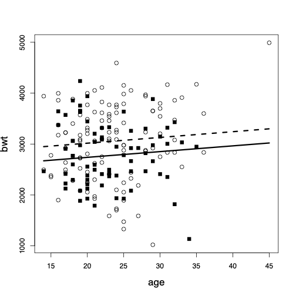
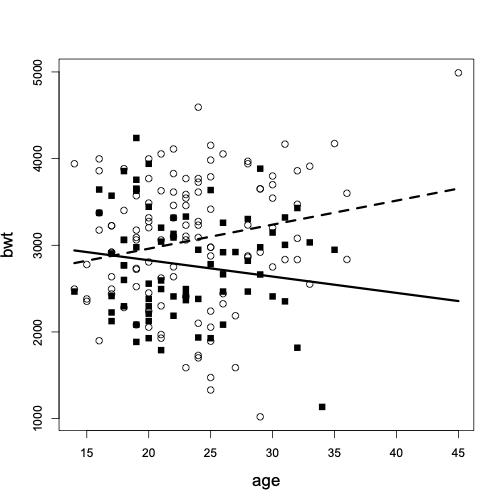

```{r}
#| echo: false
library(tidyverse)
library(bayesrules)
theme_set(theme_gray(base_size = 18))
library(ggplot2)
library(haven)
library(readr)
library(gtsummary)

salt <- read_csv("salt.csv") 
# change salt_level to a factor with levels "low" and "high"
salt$salt_level <- factor(salt$salt_level, levels = c(0, 1), labels = c("low", "high"))

```


## Overview

- Simple linear regression models with one binary explanatory variable
- Statistical inference using linear regression models
- Simple linear regression models with one numerical explanatory variable
- Model assessment and diagnostics
- Multiple linear regression models


## Introduction

- We discuss **linear regression models** for either testing a hypothesis
regarding the relationship between one or more **explanatory variables** and a response variable, or **estimating** (predicting) unknown values of the
response variable using one or more **predictors**.

- We use $X$ to denote explanatory variables and $Y$ to
denote response variables. 

- We start by focusing on problems where the explanatory
variable is binary. 

- We then continue our discussion for situations
where the explanatory variable is numerical.


# **Single Binary Explanatory Variable** 


## Blood Pressure and Salt Consumption

- Suppose that we want to investigate the relationship between sodium
chloride (salt) consumption (low vs. high consumption) and blood pressure among elderly people (e.g., above 65 years old). 

- We have a data set that contains the blood pressure of 25 elderly people
  with either a low or high sodium chloride diet.

- The data set is called **salt** and contains the following variables:
  - **bp**: blood pressure (in mmHg)
  - **salt_level**: sodium chloride diet (low vs. high)
  


## Blood Pressure and Salt Consumption

```{r}
#| echo: false
#| fig.align: "center"

ggplot(salt, aes(x = salt_level, y = bp)) +
  geom_boxplot() +
  labs(x = "Sodium Chloride Diet", y = "Blood Pressure") +
  theme_minimal()

```


## Blood Pressure and Salt Consumption
```{r}
#| echo: false
#| fig.align: "center"

ggplot(salt, aes(x = salt_level, y = bp)) +
  geom_point() +
  labs(x = "Sodium Chloride Diet", y = "Blood Pressure") +
  theme_minimal()

```

## Mean Trend
```{r}
#| echo: false
#| fig.align: "center"

mean_low <- mean(salt$bp[salt$salt_level == "low"])
mean_high <- mean(salt$bp[salt$salt_level == "high"])

ggplot(salt, aes(x = salt_level, y = bp)) +
  geom_point() +
  labs(x = "Sodium Chloride Diet", y = "Blood Pressure") +
  
  # Use annotate for the line between means
  annotate("segment", x = 1, y = mean_low, xend = 2, yend = mean_high,
           color = "blue", size = 1) +

  # Use annotate for mean points
  annotate("point", x = 1, y = mean_low, 
           color = "blue", size = 3, shape = 21, fill = "white") +
  annotate("point", x = 2, y = mean_high, 
           color = "blue", size = 3, shape = 21, fill = "white") +

  theme_minimal()
```


## Regression Line
  
- Using the **intercept** $a$ and **slope** $b$, we can write the equation for the straight line that connects the estimates of the response variable for different values of $X$ as follows:
$${\hat{y}}  =  a + b x.$$

  
  
- The above equation specifies a straight line called the **regression line**. 
  
- The regression line captures  the linear
  relationship between the response variable (here, blood pressure) and
  the explanatory variable (here, low vs. high sodium chloride diet).
  


## Regression Line

- For this example,
\begin{equation*}
  \hat{y}  =  133.17 + 6.25 x.
\end{equation*}
  
- We _expect_ that on average the blood
  pressure increases by 6.25 units for _one unit increase_ in $X$. 
  
- In this case, one unit increase in $X$ from 0
  to 1 means moving from low to high sodium chloride
  diet group.
  

## Estimation and Prediction


- For an individual with $x=0$ (i.e., low sodium chloride diet), the estimate (expected value) of blood pressure according to the above regression line is
\begin{eqnarray*}
  \hat{y} & = & a + b \times 0 = a \\
  & = & \hat{y}_{x=0},
\end{eqnarray*}
  which is the sample mean for the first group. 

- For an individual with
  $x=1$ (i.e., high sodium chloride diet), the estimate according to the above regression line is
\begin{eqnarray*}
  \hat{y} & = & a + b \times 1 = a+b \\
  & = & \hat{y}_{x=1}.
\end{eqnarray*}
  
 


## Residual
  
  - We refer to the difference between the observed and estimated values of
  the response variable as the **residual**. 
  
  - For individual $i$, we
  denote the residual $e_{i}$ and calculate it as follows:
\begin{equation*}
  e_{i}  =  y_{i} - \hat{y}_{i}.
\end{equation*}

  - For instance, if someone belongs to the first
  group, her estimated blood pressure is $\hat{y}_{i} = a =133.17$. 
  
  - Now if the observed value of her blood pressure is $y_{i} =
    135.08$, then the residual is
\begin{equation*}
  e_{i}  = 135.08 - 133.17 = 1.91.
\end{equation*}
  


## Residual Sum of Squares (RSS)
  
- As a measure of discrepancy between the observed values and those
  estimated by the line, we calculate the **Residual Sum of Squares** (RSS):
  \begin{equation*}
  \mathit{RSS} =  \sum_{i}^{n} e_{i}^{2}.
  \label{RSS}
  \end{equation*}
  
- Among all possible straight lines we could have
  drawn, the linear regression line provides the smallest
  value of RSS. 
  
- Therefore, the above approach for finding the regression line is called the **least-squares** method, and the resulting line is called the **least-squares** regression line.
  


# **Inference**


## Statistical Inference Using Simple Linear Regression Models

- We discussed fitting a regression line to observed data with one numerical response variable and one binary explanatory variable. 
  
- As usual, we would like to extend our findings to the entire
  population, i.e., **perform statistical inference**. 
  
- More specifically, we want to **predict** the unknown value of the response variable in the population, **estimate** regression parameters, and **test hypotheses** regarding the relationship between the response and explanatory variables. 


## Statistical Inference Using Simple Linear Regression Models
  
- We start by extending our regression model to the whole population. 
  
- Recall that
  \begin{eqnarray*}
  e_{i}  & = & y_{i} - \hat{y}_{i}\\
  \hat{y}_{i} & = & a + b x_{i}
  \end{eqnarray*}

## Statistical Inference Using Simple Linear Regression Models

- Based on this line, we can write the value of the response variable for
  individual $i$ in terms of the above regression line and the residual:
    \begin{equation*}
  y_{i} = a + b x_{i} + e_{i}.
  \end{equation*}
  
  
- For the whole population we write the model as follows:
\begin{equation*}
  Y = \alpha + \beta X + \epsilon
\end{equation*}
  
## Simple Linear Regression Models
- We refer to the above equation as the **linear
    regression model**. 
  
- More specifically, we call it the **simple
    linear regression model** since there is only one explanatory variable.
  
- We refer to $\alpha$ and $\beta$ as the **regression parameters**.
  More specifically, $\beta$ is called the **regression coefficient** for the explanatory variable. 
  
  
- $\epsilon$ is called the **error term**,
  representing the difference between the estimated (based on the regression line for the entire population) and the actual values of $Y$ in the population. 
  
## Estimating Regression Parameters
  
- The slope $a$ and the intercept $b$ provide **point estimates** for regression parameters $\alpha$ and $\beta$.

- Point estimates, however, do not reflect the extent of our uncertainty. Therefore, we find **interval estimates** based on confidence intervals.

- Confidence intervals:
\begin{equation*}
  [b - t_{\mathrm{crit}} \times \mathit{SE}_{b}, b + t_{\mathrm{crit}} \times \mathit{SE}_{b}].
\end{equation*}
  
- For simple linear regression models, the standard error $\mathit{SE}_{b}$ is 
\begin{equation*}
  \mathit{SE}_{b}  =
    \frac{\sqrt{\mathit{RSS}/(n-2)}}{\sqrt{\sum_{i} (x_{i} - \bar{x})^2}}
\end{equation*}

## Fitting a Linear Regression Model in R

```{r}
#| fig.align: "center"
model <- lm(bp ~ salt_level, data = salt)
summary(model)
```


## Fitting a Linear Regression Model in R

```{r}
#| fig.align: "center"
confint(model)
```


## Hypothesis Testing with Simple Linear Regression Models
- Linear regression models can be used for testing hypotheses regarding
  possible linear relationship between the response variable and the
  explanatory variable. 
  
- The null hypothesis stating no _linear_ relationship between the two variable can be written as $H_{0}: \beta=0$.
  
- Similar to the two sample t-test, we first find the $t$-score.
  
- Then, we find the $p$-value (i.e., the observed significance level) by
  calculating the probability of as or more extreme values than $t$-score
  under the null hypothesis.


## Hypothesis Testing with Simple Linear Regression Models
- For linear regression models, the $t$-score is
  \begin{equation*}
  t  =  \frac{b}{\mathit{SE}_{b}}.
  \end{equation*}
  
- We find the corresponding $p$-value as follows:
\begin{array}{l@{\quad}l}
      \mbox{if}\ H_{A}: \beta < 0, & p_{\mathrm{obs}} = P(T \leq t), \\
      \mbox{if}\ H_{A}: \beta > 0, & p_{\mathrm{obs}} = P(T \geq t ), \\
      \mbox{if}\ H_{A}: \beta \ne 0, & p_{\mathrm{obs}} = 2 \times P\bigl(T \geq | t | \bigr),
\end{array}

  
- $T$ has a $t$-distribution with $n-2$ degrees of freedom.
  


# **Numerical Explanatory Variable**


## One Numerical Explanatory Variable
- We now discuss simple linear regression models (i.e., linear regression with only one explanatory variable), where the explanatory variable is numerical.

## Blood pressure and salt consumption

```{r}
#| echo: false
#| fig.align: "center"

ggplot(salt, aes(x = salt, y = bp)) +
  geom_point() +
  labs(x = "Sodium Chloride Diet", y = "Blood Pressure") +
  theme_minimal()

```

## Blood pressure and salt consumption

- As before, we want to find a straight line that captures the relationship between the two variables. 

- Similar to what we discussed before, among all possible lines we can pass through the data, we choose the _least-squares regression line_, which is the one with the _smallest sum of squared residuals_. 


## Blood pressure and salt consumption

```{r}
#| echo: false
#| fig.align: "center"

ggplot(salt, aes(x = salt, y = bp)) +
  geom_point() +
  geom_smooth(method = "lm", se = FALSE, color = "blue") +
  labs(x = "Sodium Chloride Diet", y = "Blood Pressure") +
  theme_minimal()
```


## One Numerical Explanatory Variable

- First, we find the slope of
  regression line using the sample correlation coefficient, $r$, and the sample standard deviation of $Y$ of $X$, denoted as $s_{y}$ and $s_x$ respectively,
\begin{equation*}
  b  =  r \frac{s_{y}}{s_{x}}.
\end{equation*}
  
- After finding the slope, we find the intercept as follows:
\begin{equation*}
  a  =  \bar{y} - b \bar{x},
\end{equation*}
where $\bar{y}$ and $\bar{x}$ are the sample means
  
- For our example, $a=128.6$ and $b = 1.2$.


## Residual
- Given $x$, we can find the expected value of $y$ for each subject. 
  
- For one individual in our sample, the
  amount of daily sodium chloride intake is $x_{i} = 3.68$. 
  
- The estimated value of the blood pressure for this person is
\begin{equation*}
  \hat{y}_{i}  =  128.60 + 1.20 \times 3.68 = 133.02.
\end{equation*}

- The actual blood pressure for this individual is $y_{i} = 128.3$. The
  residual  therefore is
\begin{equation*}
  e_{i} = y_{i} - \hat{y}_{i} = 128.3 - 133.02 = - 4.72.
\end{equation*}

## Prediction

- We can also use our model for **predicting** the unknown values of the response variable (i.e., blood pressure) for all individuals in the target population. 
  
- For example, if we know the amount of daily sodium chloride
  intake is $x=7.81$ for an individual, we can predict her blood pressure
  as follows:
\begin{equation*}
  \hat{y}  =  128.60 + 1.20 \times 7.81 = 137.97.
\end{equation*}


## Interpretation
  
- The interpretation of the intercept $a$ and the slope $b$ is similar to what we had before.
  
- $a=128.6$: the _expected_ value of blood pressure is 128.6 for subjects with zero sodium chloride diet. 

- $b=1.2$: the _expected_ value of blood pressure increases by 1.2 points corresponding to one unit increase in the
  daily amount of sodium chloride intake.


## Confidence Interval
- As mentioned above, $a$ and $b$ are the point estimates for the regression parameters $\alpha$ and $\beta$,
\begin{equation*}
  Y = \alpha + \beta X + \epsilon
\end{equation*}
  
- Finding confidence intervals for regression parameters $\alpha$ and
  $\beta$ also remains as before. 
  
- More specifically, the confidence
  interval for regression coefficient is obtained as follows:
\begin{eqnarray*}
  [b - t_{\mathrm{crit}} \times \mathit{SE}_{b}, b + t_{\mathrm{crit}} \times \mathit{SE}_{b}].
  \end{eqnarray*}
  

## Hypothesis Testing
  
- The steps for performing hypothesis testing regarding the linear
  relationship between the response and explanatory variables also remain
  the same. 
  
- The null hypothesis is $H_{0}: \beta = 0$, which indicates
  that the two variables are not linearly related.
  
- To evaluate this hypothesis, we need to find the $t$-score first,
\begin{equation*}
  t  =  \frac{b}{\mathit{SE}_{b}}.
\end{equation*}
  

## Statistical inference using regression models
  
```{r}
#| fig.align: "center"

model <- lm(bp ~ salt, data = salt)
summary(model)
```

## Statistical inference using regression models

```{r}
#| fig.align: "center"

confint(model)
```


## Goodness of Fit

- We now want to examine how well the regression line represents the observed data; in other words, how well the regression model **fits** the data.
  
- In statistics, we use **goodness-of-fit** measures for this purpose. 
  
- The residual sums of squares (RSS) can be interpreted as the **unexplained variation** or **lack of fit**.
  
- The **total variation** in the response variable is measured by the **Total Sum of Squares** (TSS),
\begin{eqnarray*}
  \mathit{TSS} & = & \sum_{i}^{n}(y_{i} - \bar{y})^{2}.
\end{eqnarray*}
  
 
## Goodness of Fit
- The fraction $\mathit{RSS}/\mathit{TSS}$ can be interpreted as the percent of total variation that was not explained by the regression model.
  
- In contrast, $1 - \mathit{RSS}/\mathit{TSS}$ is fraction of total variation explained by the model. 
  
- This fraction is $R^{2}$, which measures the goodness of fit for the regression model,
\begin{eqnarray*}
  R^{2} & = & 1 - \frac{\mathit{RSS}}{\mathit{TSS}}.
\end{eqnarray*}
  
- For \emph{simple linear regression} models with one numerical explanatory
  variable, $R^{2}$ is equal to the square of Pearson's correlation coefficient
  $r$.
  
## Model Assumptions and Diagnostics
- The typical assumptions of linear regression models are

  - Linearity
  
  - Independent observations
  
  - Constant variance and normality of the error term
  \begin{eqnarray*}
  \epsilon & \sim & N\bigl(0, \sigma^{2}\bigr).
  \end{eqnarray*}


## Model Assumptions and Diagnostics

- We can use the **residual plot** to check the assumptions of linearity and constant variance.

- The residual plot is a scatter plot of the residuals $e_{i}$ against the
  fitted values $\hat{y}_{i}$.

- If the assumptions of linearity and constant variance are satisfied, we
  expect the residuals to be randomly scattered around zero, with no
  discernible pattern.
  
## Model Assumptions and Diagnostics  
```{r}
#| fig.align: "center"

ggplot(salt, aes(x = fitted(model), y = resid(model))) +
  geom_point() +
  geom_hline(yintercept = 0, linetype = "dashed", color = "red") +
  labs(x = "Fitted Values", y = "Residuals") +
  theme_minimal()
```


## Multiple Linear Regression
  
- So far, we have focused on linear regression models with only one
  explanatory variable. 
  
- In most cases, however, we are interested in the
  relationship between the response variable and multiple explanatory variables. 
  
- Such models with multiple explanatory variables or predictors are called **multiple linear regression** models.
  
- For example, we might want to examine the relationship between babies' birthweight and their mothers' age and smoking status during pregnancy.


## Multiple Linear Regression

- A multiple linear regression model with $p$ explanatory variables can
  be presented as follows:
\begin{equation*}
  Y  =  \alpha + \beta_{1} X_{1} + \beta_{2} X_{2} + \cdots + \beta_{p} X_{p} + \epsilon.
  \end{equation*}
  
- We use the least-squares method as before to estimate the model parameters,
  \begin{equation*}
  \hat{y}  =  a + b_{1}x_{1} + b_{2}x_{2} + \cdots + b_{p}x_{p}.
  \end{equation*}
  


## Birthweight and Smoking

```{r}
library(MASS)
data("birthwt")
model <- lm(bwt ~ age + factor(smoke), data=birthwt)
summary(model)
```


## Interpretation

- The intercept in multiple linear regression model is the expected (average) value of the response variable when all the explanatory variables in the model are set to zero simultaneously. 

- In the above example, the intercept is $a=2791$, which is obtained by setting age and smoking to zero. 

- In this case, this is not a reasonable interpretation since mother's age cannot be zero.


## Interpretation

- We interpret $b_{j}$ as our estimate of the expected (average) change in the response variable
associated with a unit increase in the corresponding explanatory variable $x_{j}$ **while all other explanatory variables in the model remain fixed**.

- For the above example, the point estimate of the regression coefficient for _age_ is $b_{1}=11$, and the estimate of the regression coefficient for _smoke_ is $b_{2} = -278$. 


## Interpretation

- We expect that the birthweight of babies increase by 11 grams as the mother's age increases by one year among mothers with the same smoking status. 

- The expected birthweight changes by $-278$ (decreases by $278$) grams associated with one unit increase in the value of the variable _smoke_ (i.e., going from non-smoking to smoking) among mothers with the same age.


## Additivity

- In multiple linear regression models, we usually assume that the effects of explanatory variables on the response variable are **additive**.

- This means that the expected change in the response variable corresponding to one unit increase in one of the explanatory variables remains the same regardless of the values of other explanatory variables in the model.

- In the next plot, nonsmoking mothers are shown as _circles_, while smoking mothers are shown as _squares_. The _dashed line_ shows the regression line among nonsmoking mothers, and the _solid line_ shows the regression line among the smoking mothers


## Additivity

_circles_: nonsmoking mothers, _squares_: smoking mothers. _dashed line_:  regression line among nonsmoking mothers, _solid line_: regression line among the smoking mothers

::: {.v-center}

{width=60%}
:::


## Interaction

- We might believe that the effects are not additive.

- That is, the effect of one explanatory variable $x_{1}$ on the response variable depends on the
value of another explanatory variable $x_{2}$ in the model.

- We can still use linear regression models by including a new variable $x_{3} = x_{1}x_{2}$,
$$\begin{eqnarray*}
\hat{y} = a + b_{1}x_{1} + b_{2}x_{2} + b_{12}x_{1}x_{2}
\end{eqnarray*}$$


## Interaction

- The term $x_{1}x_{2}$ is called the **interaction term**. 

- We refer to $b_{1}$ and $b_{2}$ as the **main effects**, and refer to $b_{12}$ as the **interaction effect**.


- Note that when we include an interaction term in our model, we should be cautious about how we interpret model parameters. 


- In R, to fit models with interaction terms, we use "*" instead of "+" to separate variables. 


## Interaction

```{r}
model <- lm(bwt ~ factor(smoke) * age, data=birthwt)
summary(model)
```


## Interaction

::: {.v-center}

{width=70%}

:::
