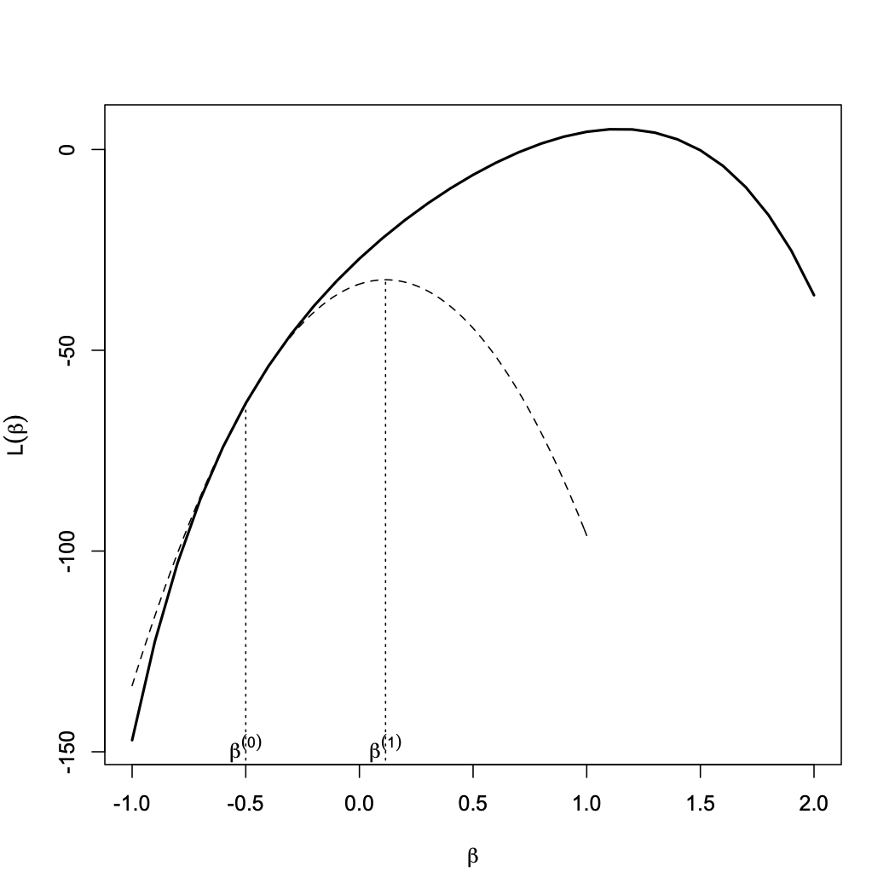
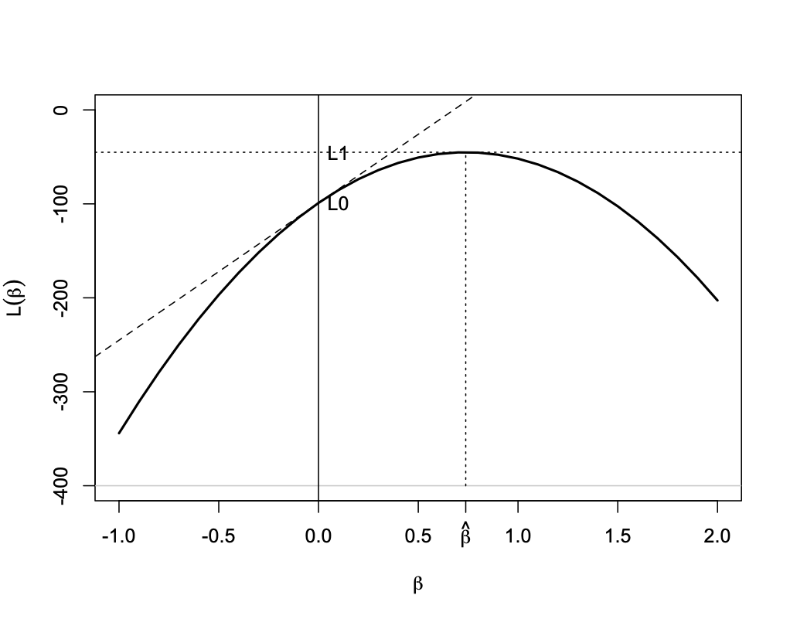

```{r}
#| echo: false
library(tidyverse)
library(bayesrules)
theme_set(theme_gray(base_size = 18))
library(ggplot2)
library(haven)
library(readr)
library(gtsummary)

```


## Introduction

- For linear regression models, the response variable, $Y$, is assumed to be a real-valued continuous random variable. 

- $Y$ is modeled as a [stochastic] function of a set of explanatory variables (predictors) as follows:
\begin{eqnarray*}
Y & = & \alpha + \beta_{1} X_{1} + \cdots + \beta_{p} X_{p} + \epsilon
\end{eqnarray*}

- The right-hand side is comprised of two parts
  
  - Systematic component: $\alpha + \beta_{1} X_{1} + \cdots + \beta_{p} X_{p}$

  - Normally distributed (with mean zero and constant variance $\sigma^{2}$) random error: $\epsilon$


## Introduction

- Denote the mean of the response variable, $Y$ as $\mu$.

- The systematic component gives the expected value (mean) of the response variable,
\begin{eqnarray*}
\mu_X = \alpha + \beta_{1} X_{1} + \cdots + \beta_{p} X_{p}
\end{eqnarray*}

- Note that the mean is modeled as a function of predictors so it changes as the values of predictors change. (We usually drop the index $X$ for simplicity.)

- The values of response variable are normally distributed around this mean with a constant variance (i.e., the variance does not change with $X$):
\begin{eqnarray*}
Y | X \sim N(\mu_x, \sigma^2)
\end{eqnarray*}


## Introduction
 
- The regression model has therefore two components:

  - Systematic component: $\alpha + \beta_{1} X_{1} + \cdots + \beta_{p} X_{p}$

  - Random component: $Y \sim N(\mu_{X}, \sigma^{2})$

- And the regression model connects the mean of the random component to the systematic component,
\begin{eqnarray*}
\mu_X = \alpha + \beta_{1} X_{1} + \cdots + \beta_{p} X_{p}
\end{eqnarray*}


## Introduction

- Using a sample of $n$ observations from the population, we can estimate the regression parameters and find the estimated value of $\mu$ (i.e., mean of the response variable) as follows:
\begin{eqnarray*}
\hat{\mu} & = & a + b_{1} x_{1} + \cdots + b_{p} x_{p} 
\end{eqnarray*}

- We interpret $\hat{\mu}$ as our estimate for the expected (mean) of the response variable for subjects with values $x_{1}, \ldots, x_{p}$.


## Generalized Linear Models

- Now consider situations where the response variable is a binary random variable (e.g., disease status), count variable (e.g., number of accidents), or it is continuous, but it can only take positive values (e.g., tumor size).

- For such problems, we can still define the systematic component as before. 

- However, it would not make sense to assume that the random component $Y$ is normally distributed. 

- Also, it would not make sense to simply set the mean of the random component equal to the systematic component since the systematic component can theoretically take any positive or negative real values while that would not be the case for the mean of such response variables.


## Generalized Linear Models

 
- To address these issues, we use a more general class of linear models that avoid the restrictive assumptions of linear regression models. 

- We call these models collectively **generalized linear models**, or GLM for short. 

- Using GLM, we can use other family of distributions other than normal for the random component.

- For example, we use the Bernoulli (or Binomial) distribution family when the response variable is a binary variable.

- For count response variables, we typically use the Poisson distribution family. 


## Generalized Linear Models

 
- Also, instead of simply setting the mean of the response variable to the systematic component, we set some appropriate transformations of the mean equal to the systematic component.


- For binary response variables with a Bernoulli distribution, it is common to use the **logit** (i.e., log-odds) transformation as the link function,
\begin{eqnarray*}
\log(\frac{\mu}{1-\mu}) = \alpha + \beta_{1} X_{1} + \cdots + \beta_{p} X_{p}
\end{eqnarray*}

## Generalized Linear Models

- Note that binary variable $\mu = P(Y=1|X)$; that is, $\mu$ is the probability of the outcome of interest (denoted as 1) given the explanatory variables.

- Although $\mu$ is a real number between 0 and 1, its logit transformation can be any real number between $-\infty$ to $+\infty$.

- The resulting models are called **logistic regression models**.


## Generalized Linear Models


- For count response variables with a Poisson distribution, we usually use the log transformation,
\begin{eqnarray*}
\log(\mu) = \alpha + \beta_{1} X_{1} + \cdots + \beta_{p} X_{p}
\end{eqnarray*}

- The log function in this case is called the **link function**.

- Note that although $\mu$ here can take positive values only, $\log(\mu)$ can be both positive and negative. 

- The resulting models are called **Poisson regression model**.


## Generalized Linear Models


- For linear regression models, we used the least-squares method to estimate model parameters. 

- For generalized linear models, we use an alternative method called **maximum likelihood estimation** (MLE). 

- Informally, this is an optimization approach to find the parameter that make the observed data most probable according to our [probabilistic] model. 

- We denote the resulting parameter estimates as $\hat{\alpha} = a$, $\hat{\beta}_1 = b_1$, \ldots, $\hat{\beta}_{p} = b_p$.


## Likelihood Function

- To find the likelihood function, we first need to assume a probability distribution for the data, i.e., $P(y | \theta)$, where $\theta$ are unknown parameters. 

- This distribution reflects our assumptions about the mechanism that generates the data.

- The likelihood function is defined by plugging-in the  observed data in the probability distribution and expressing it as a function of model parameters, i.e., $f(\theta; y)$.   

## Likelihood Function

- For regression models, the data include the response variables $y$ and the explanatory variables $x$. Therefore, in general we need to specify $P(x, y)$. 
 
- However, since $x$ are assumed to be fixed at their observed value, $P(x)=1$, the joint distribution reduces to the conditional distribution of $y | x$.
\begin{eqnarray*}
P(x, y) = P(x)P(y|x) = P(y|x)
\end{eqnarray*}

- Therefore, we only need to specify the conditional distribution of $y$ given $x$.


## Likelihood Function -- Linear Regression

- For linear regression models, we assume this $P(y|x)$ is a normal distribution. 

- As we mentioned, we model the expectation of this distribution as a linear function of $x$, i.e., $E(y|x) = x\beta$, and we assume the variance of this distribution is $\sigma^{2}$ (which is independent of $x$ and $\beta$).

- Therefore, assuming that the observations are independent, we have
\begin{eqnarray*}
y | x, \beta & \sim &({2\pi} \sigma^{2} )^{-n/2}\exp(- \frac{\sum_{i=1}^{n} (y_{i} - x_{i} \beta)^{2}}{2 \sigma^{2}})
\end{eqnarray*}

## Likelihood Function -- Linear Regression

- The likelihood function is specified by plugging-in the observed values of $x$ and $y$ in the probability distribution and expressing the result as a function of $\beta$ (for now, we assume $\sigma$ is fixed).  
\begin{eqnarray*}
f(\beta) & = & ({2\pi} \sigma^{2} )^{-n/2} \exp(- \frac{\sum_{i=1}^{n} (y_{i} - x_{i} \beta)^{2}}{2 \sigma^{2}})
\end{eqnarray*}


## Likelihood Function -- Logistic Regression

- As mentioned before, for binary outcome variable, we use the binomial distribution. 
\begin{eqnarray*}
y_i | n_i, \mu_i \sim \textrm{binomial}(n_i, \mu_i)
\end{eqnarray*}
with the Bernoulli distribution as its special case when $n_i = 1$.

- As usual, we define the systematic part of the model $x_{i} \beta$ 


## Likelihood Function -- Logistic Regression

- A common link function for this model is the **logit** function and defined as 
\begin{eqnarray*}
g^{-1}(\mu_i) =\log(\frac{\mu_i}{1 - \mu_i}) = x_i \beta
\end{eqnarray*}
where $\mu_i$ is the probability of success (i.e., $y_i = 1$).

- As the result
\begin{eqnarray*}
\mu_i & = & \frac{\exp(x_i \beta)}{1+ \exp(x_i \beta)}
\end{eqnarray*}


## Likelihood Function -- Logistic Regression

- The likelihood is therefore defined in terms of $\beta$ as follows:
\begin{eqnarray*}
p(y | \mu ) & \propto & \prod_{i=1}^{n} \mu^{y_i}_i (1-\mu_i)^{n_i - y_i} \\
p(y | \beta) & \propto & \prod_{i=1}^{n}  \Big( \frac{\exp(x_i \beta)}{1+ \exp(x_i \beta)} \Big) ^{y_i} \Big(  \frac{1}{1+ \exp(x_i \beta)} \Big )^{n_i - y_i} \\  
\end{eqnarray*}


## Likelihood Function -- Poisson Regression

- When the outcome variable, $y$, represents counts, we use the Poisson model. 
\begin{eqnarray*}
y_i | \mu_i \sim \textrm{Poisson}(\mu_i)
\end{eqnarray*}

- The systematic components are defined as before: $x_i \beta$.
The usual link function for this model is the log link: 
\begin{eqnarray*}
g^{-1}(\mu_i) = \log(\mu_i) 
\end{eqnarray*}

- We therefore have
\begin{eqnarray*}
\mu_i = \exp(x_i \beta)
\end{eqnarray*}


## Likelihood Function -- Poisson Regression

- The likelihood in terms of $\beta$ can obtained as follows:
\begin{eqnarray*}
p(y_i | \mu_i) & \propto & \prod_{i}^{n} \exp(- \mu_i) \mu_{i}^{y_i} \\
p(y_i | \beta) & \propto & \prod_{i}^{n} \exp[- \exp(x_i \beta) ] [\exp(x_i \beta)]^{y_i} 
\end{eqnarray*}


## Maximum Likelihood Estimation

- To estimate the model parameters, we find the values that maximize the likelihood of the observed data.

- For this, we maximize the likelihood function with respect to model parameters. 

- Of course, it is easier to maximize the **log of likelihood function**, i.e., $L(\beta) = log(f(\beta))$.
 
- In many problems, this is a convex optimization problem. 

## Maximum Likelihood Estimation

- To maximize the likelihood function, we can focus on the part of the function that is related to the parameter (i.e., **kernel**).

- For linear regression models, 
\begin{eqnarray*}
L(\beta) & = & -{\sum_{i=1}^{n} (y_{i} - x_{i} \beta)^{2}} - log({2 \sigma^{2}})
\end{eqnarray*}


- For simplicity, we can also remove all the constant (not related to the parameters) parts;
\begin{eqnarray*}
L(\beta) & = & -{\sum_{i=1}^{n} (y_{i} - x_{i} \beta)^{2}} 
\end{eqnarray*}


## Maximum Likelihood Estimation


- Now we can simply set the first derivative to zero (likelihood equation) to obtain the maximum likelihood estimate 
\begin{eqnarray*}
\frac{\partial L(\beta)}{\partial \beta} & = & 2{\sum_{i=1}^{n} x_{i} (y_{i} - x_{i} \beta)} = 0 \\
\hat{\beta} & =  &(x^{\top}x)^{-1}x^{\top}y
\end{eqnarray*}

- In this case, MLE is the same as the least squares estimate.


## Numerical methods for finding MLE

- The likelihood equation for linear regression models takes a simple form that can be solved analytically. 
 
- However, the likelihood equations are in general nonlinear in $\beta$, and as the result, numerical methods are needed to find $\hat{\beta}$.
 
- A common approach is to use the Newton-Raphson method to maximize the likelihood function, or equivalently, maximize the log-likelihood function, or minimize the negative log-likelihood function (called the **energy function** in machine learning). 

## Newton-Raphson method

- The Newton-Raphson method is a general purpose iterative algorithm for solving nonlinear equations. 
 
- In statistics, we use this method to the solve likelihood equation. 

- Denote the log-likelihood as $L(\beta)$. Our objective is to find the value of $\beta$ for which $L(\beta)$ is maximized. 

- We focus on models with a single parameter.

## Newton-Raphson method

- Start with an initial guess $\beta^{(0)}$. Iteratively update your guess as follows:
  - At each iteration $n$, use the Taylor series expansion (up to the quadratic term) around the current value of $\beta^{(n)}$ 
\begin{eqnarray*}
L(\beta) & \simeq & L(\beta^{(n)}) + L'(\beta^{(n)})(\beta - \beta^{(n)})+ \frac{1}{2}L''(\beta^{(n)})(\beta-\beta^{(n)})^2
\end{eqnarray*}
 
  - Now take the derivative of $L(\beta)$, set it to zero and solve for $\beta$. 
 Regard the answer as your next guess $\beta^{(n+1)}$:
\begin{eqnarray*}
\beta^{(n+1)} & = & \beta^{(n)} - \frac{L'(\beta^{(n)})}{L''(\beta^{(n)})}
\end{eqnarray*}

  - Continue the above process until the algorithm converges. 


## Newton-Raphson method

::: {.v-center}

{width=60%}
:::


## Fisher Scoring Algorithm

- We can rewrite the equation for our next guess as
\begin{eqnarray*}
\beta^{(n+1)} & = & \beta^{(n)} + \frac{u(\beta^{(n)})}{o(\beta^{(n)})}
\end{eqnarray*}
where $u(\beta)$ is the score function, and 
\begin{eqnarray*}
o(\beta^{(n)}) & = & -L''(\beta^{(n)})
\end{eqnarray*}
 
- $o(\beta)$ is called the **observed information**, and its expectation $i(\beta) = E[-L''(\beta)]$ is called the **Fisher information**. 

## Fisher Scoring Algorithm

- Using Fisher information instead of the observed information leads to the **Fisher Scoring Algorithm**:
\begin{eqnarray*}
\beta^{(n+1)} & = & \beta^{(n)} + \frac{u(\beta^{(n)})}{i(\beta^{(n)})}
\end{eqnarray*}


## Wald, score, and likelihood ratio tests

::: {.v-center}

{width=80%}

:::

 


## Wald, score, and likelihood ratio tests

- Using the above graph, we can create three different tests for statistical inference:

  - **Wald**: based on the distance between $\hat{\beta}$ and $\beta_0$
  
  - **Score**: based on difference between the slopes at $\hat{\beta}$ and $\beta_0$
  
  - **Likelihood ratio**: based on the distance between $L_1$ and $L_0$


