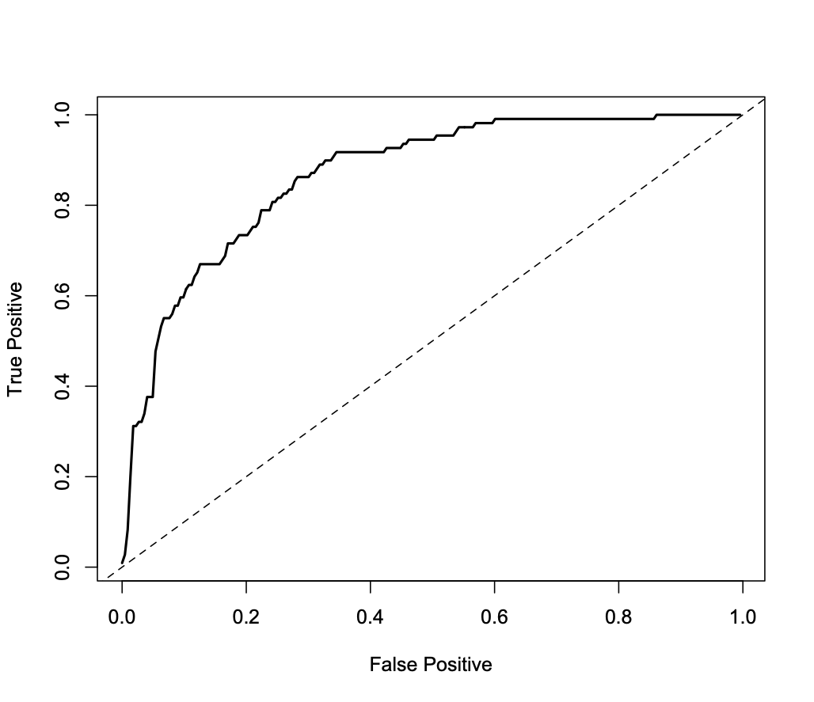

```{r}
#| echo: false
library(bayesrules)
library(tidyverse)
library(rstanarm)
library(bayesplot)
library(janitor)
library(rstan)
library(gridExtra)
theme_set(theme_gray(base_size = 18))
```

## Reference

The notes for this lecture are derived from  [Chapter 9 of the Bayes Rules! book](https://www.bayesrulesbook.com/chapter-9)


##

```{r}
glimpse(bikes)
```


## Rides Dataset

:::{.pull-left}


```{r echo = FALSE, fig.height=5}
ggplot(data.frame(x = c(-4,4)), aes(x=x)) + 
  stat_function(fun = dnorm) + 
  labs(y = expression(paste("f(y|",mu,",",sigma,")")), x = "y (rides)") + 
  scale_x_continuous(breaks = c(-3,0,3), labels = c(expression(paste(mu,"- 3 / ",sigma)), expression(mu), expression(paste(mu,"+ 3 / ",sigma))))
```

:::

:::{.pull-right}

$Y_i | \mu, \sigma  \stackrel{ind}{\sim} N(\mu, \sigma^2)$  
$\mu \sim N(\theta, \tau^2)$
$\sigma  \sim \text{ some prior model.}$

:::


## Regression Model

$Y_i$ the number of rides  
$X_i$ temperature (in Fahrenheit) on day $i$. 

. . .

$\mu_i = \beta_0 + \beta_1X_i$

. . .

$\beta_0:$ the typical ridership on days in which the temperature was 0 degrees ( $X_i$=0). It is not interpretable in this case.

$\beta_1:$ the typical change in ridership for every one unit increase in temperature.


## Normal likelihood model

\begin{split}
Y_i | \beta_0, \beta_1, \sigma & \stackrel{ind}{\sim} N\left(\mu_i, \sigma^2\right) \;\; \text{ with } \;\; \mu_i = \beta_0 + \beta_1X_i \; .\\
\end{split}

```{r}
#| echo: false
#| fig-align: center
set.seed(454)
x <- rnorm(100, mean = 68, sd = 12)
y_1 <- -2511 + 88*x + rnorm(100, mean=0, sd = 2000)
y_2 <- -2511 + 88*x + rnorm(100, mean=0, sd = 200)
bikes_sim <- data.frame(x, y_1, y_2) %>% filter(y_1 > 0)
g1 <- ggplot(bikes_sim, aes(x=x,y=y_1)) + 
    geom_point() + 
    geom_smooth(method = "lm", se = FALSE) + 
    #scale_x_continuous(breaks = c(25)) + 
    #scale_y_continuous(breaks = c(0,30), limits = c(min(y_1,y_2),max(y_1,y_2))) +
    lims(y = c(min(y_1,y_2),max(y_1,y_2))) + 
    labs(x = "x (temp)", y = "y (rides)")
g2 <- ggplot(bikes_sim, aes(x=x,y=y_2)) + 
    geom_point() + 
    geom_smooth(method = "lm", se = FALSE) + 
    #scale_x_continuous(breaks = c(25)) + 
    #scale_y_continuous(breaks = c(30), limits = c(min(y_1,y_2),max(y_1,y_2))) + 
    lims(y = c(min(y_1,y_2),max(y_1,y_2))) + 
    labs(x = "x (temp)", y = "y (rides)")
    
gridExtra::grid.arrange(g1,g2,ncol=2)
  
```

##

These simulations show two cases where $\beta_0 = -2000$ and slope $\beta_1 = 100$.
On the left $\sigma = 2000$ and on the right $\sigma = 200$ (right). In both cases, the model line is defined by $\beta_0 + \beta_1 x = -2000 + 100 x$.


## Prior Models

$\text{likelihood model:} \; \; \; Y_i | \beta_0, \beta_1, \sigma \;\;\;\stackrel{ind}{\sim} N\left(\mu_i, \sigma^2\right)\text{ with } \mu_i = \beta_0 + \beta_1X_i$

$\text{prior models:}$ 

$\beta_0\sim N(m_0, s_0^2 )$  
$\beta_1\sim N(m_1, s_1^2 )$  
$\sigma \sim \text{Exp}(l)$


Recall: 

$\text{Exp}(l) = \text{Gamma}(1, l)$


##


```{r fig.height=5}
plot_normal(mean = 5000, sd = 1000) + 
  labs(x = "beta_0c", y = "pdf")
```

##


```{r fig.height=5}
plot_normal(mean = 100, sd = 40) + 
  labs(x = "beta_1", y = "pdf")
```

##


```{r fig.height=5}
plot_gamma(shape = 1, rate = 0.0008) + 
  labs(x = "sigma", y = "pdf")
```

##


$$\begin{split}
Y_i | \beta_0, \beta_1, \sigma & \stackrel{ind}{\sim} N\left(\mu_i, \sigma^2\right) \;\; \text{ with } \;\; \mu_i = \beta_0 + \beta_1X_i \\
\beta_{0c}  & \sim N\left(5000, 1000^2 \right)  \\
\beta_1  & \sim N\left(100, 40^2 \right) \\
\sigma   & \sim \text{Exp}(0.0008)  .\\
\end{split}$$

##

 

```{r echo = FALSE, warning=FALSE, fig.height=6, fig.width=15}
g1 <- plot_normal(mean = 5000, sd = 1000) + 
  labs(x = "beta_0c", y = "pdf")
g2 <- plot_normal(mean = 100, sd = 40) + 
  labs(x = "beta_1", y = "pdf")
g3 <- plot_gamma(shape = 1, rate = 0.0008) + 
  labs(x = "sigma", y = "pdf") + 
  lims(x = c(0,7500))
gridExtra::grid.arrange(g1,g2,g3,ncol=3)
```


## Using `rstanarm` 

```{r cache=TRUE}
bike_model <- stan_glm(rides ~ temp_feel, data = bikes,
                       family = gaussian,
                       prior_intercept = normal(5000, 1000),
                       prior = normal(100, 40), 
                       prior_aux = exponential(0.0008),
                       chains = 4, iter = 5000*2, seed = 84735,
                       refresh = FALSE) 
```

The `refresh = FALSE` prevents printing out your chains and iterations, especially useful in R Markdown.


##


```{r fig.width=12}
mcmc_trace(bike_model, size = 0.1)
```

##


```{r fig.width=12, fig.height=6}
mcmc_dens_overlay(bike_model)
```


##

##

```{r}
broom.mixed::tidy(bike_model, effects = c("fixed", "aux"),
     conf.int = TRUE, conf.level = 0.80)
```


```{r echo = FALSE}
model_summary <- broom.mixed::tidy(bike_model, effects = c("fixed", "aux"),
                      conf.int = TRUE, conf.level = 0.80)
b0_median <- model_summary[1,2]
b1_median <- model_summary[2,2]
b1_lower <- model_summary[2,4]
b1_upper <- model_summary[2,5]
```

Referring to the `tidy()` summary, the __posterior median relationship__ is

$$\begin{equation}
`r round(b0_median,2)` + `r round(b1_median,2)` X
\end{equation}$$

##


```{r}
# Store the 4 chains for each parameter in 1 data frame
bike_model_df <- as.data.frame(bike_model)
# Check it out
nrow(bike_model_df)
head(bike_model_df, 3)
```

##

```{r warning=FALSE, fig.height=4}
# 50 simulated model lines
bikes %>%
  tidybayes::add_fitted_draws(bike_model, n = 50) %>%
  ggplot(aes(x = temp_feel, y = rides)) +
    geom_line(aes(y = .value, group = .draw), alpha = 0.15) + 
    geom_point(data = bikes, size = 0.05)
```


##


 

```{r}
# Tabulate the beta_1 values that exceed 0
bike_model_df %>% 
  mutate(exceeds_0 = temp_feel > 0) %>% 
  tabyl(exceeds_0)
```


## Posterior Prediction

Suppose a weather report indicates that tomorrow will be a 75-degree day in D.C. What's your posterior guess of the number of riders that Capital Bikeshare should anticipate?


##


```{r echo = FALSE}
pred <- round(b0_median,2) + (round(b1_median,2)*75)
```


Your natural first crack at this question might be to plug the 75-degree temperature into the posterior median model.
Thus, we expect that there will be `r round(pred)` riders tomorrow:

$$`r round(b0_median,2)` + `r round(b1_median,2)`\times75 = `r pred`$$

. . .

Not quiet.

##


Recall that this singular prediction ignores two potential sources of variability:

- __Sampling variability__ in the data    
    The observed ridership outcomes, $Y$, typically _deviate_ from the model line. That is, we don't expect every 75-degree day to have the same exact number of rides.
    
. . .
    
- __Posterior variability__ in parameters $(\beta_0, \beta_1, \sigma)$    

. . .


The __posterior predictive model__ of a new data point $Y_{\text{new}}$ accounts for both sources of variability.


## Posterior Prediction with rstanarm

```{r}
# Simulate a set of predictions
set.seed(84735)
post_pred <- 
  posterior_predict(bike_model, newdata = data.frame(temp_feel = 75))
```

```{r}
head(post_pred, 3)
```


##

 

```{r fig.height=5}
# Plot the approximate predictive model
mcmc_dens(post_pred) + 
  xlab("predicted ridership on a 75 degree day")
```


##

 


```{r}
# Construct a 95% posterior credible interval
posterior_interval(post_pred, prob = 0.95)
```


## Bayesian Logistic Regression


##

$$Y = \begin{cases}
\text{ Yes rain} & \\
\text{ No rain} & \\
\end{cases} \;$$

. . .

$$\begin{split}
X_1 & = \text{ today's humidity at 9am (percent)} \\
\end{split}$$

##


```{r message=FALSE}
library(bayesrules)
library(rstanarm)
library(bayesplot)
library(tidyverse)

data(weather_perth)
weather <- weather_perth %>%
  select(day_of_year, raintomorrow, humidity9am,
         humidity3pm, raintoday)
```

##

```{r}
glimpse(weather)
```

##

```{r echo = FALSE, fig.width = 15, fig.height = 6, message=FALSE}
# Check out some relationships
ggplot(weather, aes(x = humidity9am, fill = raintomorrow)) + 
  geom_density(alpha = 0.5)
g2 <- ggplot(weather, aes(x = humidity3pm, fill = raintomorrow)) + 
  geom_density(alpha = 0.5)
g3 <- ggplot(weather, aes(x = raintoday, fill = raintomorrow)) + 
  geom_bar()
g4 <- ggplot(weather, aes(x = humidity9am, y = humidity3pm, color = raintomorrow)) + 
  geom_point()
```


## Logistic regression model 

likelihood: $Y_i | \pi_i \sim \text{Bern}(\pi_i)$

. . .

$E(Y_i|\pi_i) = \pi_i$

. . .

link function: $g(\pi_i) = \beta_0 + \beta_1 X_{i1}$

. . .

logit link function: $Y_i|\beta_0,\beta_1 \stackrel{ind}{\sim} \text{Bern}(\pi_i) \;\; \text{ with } \;\; \log\left(\frac{\pi_i}{1 - \pi_i}\right) = \beta_0 + \beta_1 X_{i1}$

. . .

$$\frac{\pi_i}{1-\pi_i} = e^{\beta_0 + \beta_1 X_{i1}}
\;\;\;\; \text{ and } \;\;\;\;
\pi_i = \frac{e^{\beta_0 + \beta_1 X_{i1}}}{1 + e^{\beta_0 + \beta_1 X_{i1}}}$$


## Bayesian logistic regression model


$\text{likelihood model:} \; \; \; Y_i | \beta_0, \beta_1 \;\;\;\stackrel{ind}{\sim} \text{Bern}(\pi_i)$

$\log(\frac{\pi_i}{1-\pi_i}) = \beta_0 + \beta_1X_{i1}$

$\text{prior models:}$ 

$\beta_0\sim N(m_0, s_0 )$  
$\beta_1\sim N(m_1, s_1 )$  


##

```{r eval = FALSE}
# Convert raintomorrow to 1s and 0s
weather <- weather %>% 
  mutate(raintomorrow = as.numeric(raintomorrow == "Yes"))

# Simulate the model
rain_model_1 <- stan_glm(raintomorrow ~ humidity9am,
                         data = weather,
                         family = binomial,
                         chains = 4, 
                         iter = 5000, 
                         warmup = 1000,
                         seed = 84735)
```

```{r echo = FALSE, cache=TRUE}
# Convert raintomorrow to 1s and 0s
weather <- weather %>% 
  mutate(raintomorrow = as.numeric(raintomorrow == "Yes"))

# Simulate the model
rain_model_1 <- stan_glm(
  raintomorrow ~ humidity9am, data = weather,
  family = binomial,
  chains = 4, iter = 5000*2, refresh = 0, seed = 84735)
```

##

```{r}
prior_summary(rain_model_1)
```


##

```{r fig.width=10}
mcmc_dens_overlay(rain_model_1)
```

##

```{r}
rain_model_1_df <- as.data.frame(rain_model_1)
head(rain_model_1_df, 3)
```

##

$$\pi = \frac{e^{\beta_0 + \beta_1 X_1}}{1 + e^{\beta_0 + \beta_1 X_1}}$$

##

```{r eval=FALSE}
# The first 50 posterior parameter sets
first_50 <- head(rain_model_1_df, 50)

# Function that calculates model trend on probability scale
prob_trend <- function(beta0, beta1, x){
  exp(beta0 + beta1*x) / (1 + exp(beta0 + beta1*x))}

# Plot the first 50 posterior model trends
ggplot(weather, aes(x = humidity9am, y = raintomorrow)) + 
  mapply(function(beta0, beta1) {
    stat_function(fun = prob_trend,
      args = list(beta0 = beta0, beta1 = beta1), size = 0.1)
    },
    beta0 = first_50$`(Intercept)`, beta1 = first_50$humidity9am
  ) + 
  labs(y = "probability of rain")
```

##

```{r echo=FALSE}
# The first 50 posterior parameter sets
first_50 <- head(rain_model_1_df, 50)

# Function that calculates model trend on probability scale
prob_trend <- function(beta0, beta1, x){
  exp(beta0 + beta1*x) / (1 + exp(beta0 + beta1*x))}

# Plot the first 50 posterior model trends
ggplot(weather, aes(x = humidity9am, y = raintomorrow)) + 
  mapply(function(beta0, beta1) {
    stat_function(fun = prob_trend,
      args = list(beta0 = beta0, beta1 = beta1), size = 0.1)
    },
    beta0 = first_50$`(Intercept)`, beta1 = first_50$humidity9am
  ) + 
  labs(y = "probability of rain")
```


## Prediction and Classification

\begin{equation}
\log\left( \frac{\pi}{1-\pi}\right) = \beta_0 + \beta_1 * 99 
\;\;\;\; \text{ and } \;\;\;\;
\pi = \frac{e^{\beta_0 + \beta_1 * 99}}{1 + e^{\beta_0 + \beta_1 * 99}} \; .
\end{equation}

##

```{r}
# Posterior predictions on log(odds) scale
logodds_prediction <- posterior_linpred(
  rain_model_1, newdata = data.frame(humidity9am = 99))

head(logodds_prediction,3)

```


##

```{r}
# Posterior predictions on probability scale
prob_prediction <- posterior_epred(
  rain_model_1, newdata = data.frame(humidity9am = 99))

head(prob_prediction,3)
```

##


```{r}
# Posterior predictions of binary outcome
set.seed(84735)
binary_prediction <- posterior_predict(
  rain_model_1, newdata = data.frame(humidity9am = 99))

head(binary_prediction,3)

```

##

```{r}
rain_model_1_df %>% 
  mutate(log_odds = c(logodds_prediction), 
    prob = c(prob_prediction), Y = c(binary_prediction)) %>% 
  head(3)
```

```{r echo = FALSE}
rain_sum <- rain_model_1_df %>% 
  mutate(log_odds = c(logodds_prediction), 
    prob = c(prob_prediction), Y = c(binary_prediction))
b0 <- round(rain_sum[1,1],3)
b1 <- round(rain_sum[1,2],3)
log_pred  <- round(b0 + b1 * 99,4)
prob_pred <- round(exp(log_pred) / (1 + exp(log_pred)),2)
```

$\beta_0 = `r b0`$ and $\beta_1 = `r b1`$

. . .

$\log( \frac{\pi}{1-\pi}) = `r b0` + `r b1` * 99 = `r log_pred`$

$\pi  = \frac{e^{`r b0` + `r b1` * 99}}{1 + e^{`r b0` + `r b1` * 99}} = `r prob_pred`$ and $Y$ is a random draw from Bern(0.52)

##

```{r eval = FALSE}
mcmc_dens(logodds_prediction) + labs(x = "log(odds)")
mcmc_dens(prob_prediction) + labs(x = "probability")
mcmc_hist(binary_prediction) + labs(x = "Y")
```

```{r echo = FALSE, fig.width = 6, message=5, fig.width=10, fig.height=5}
g1 <- mcmc_dens(logodds_prediction) + labs(x = "log(odds)")
g2 <- mcmc_dens(prob_prediction) + labs(x = "probability")
g3 <- mcmc_hist(binary_prediction) + labs(x = "Y")
gridExtra::grid.arrange(g1,g2,g3,ncol=3)
```

##

```{r}
table(binary_prediction)
colMeans(binary_prediction)
```


## Classification rule

- If $p \ge c$, then classify $Y$ as 1.
- If $p < c$, then classify $Y$ as 0.

##

```{r}
set.seed(84735)
rain_pred_1 <- posterior_predict(rain_model_1, 
                                 newdata = weather)
head(rain_pred_1, 3)
```

##

```{r}
weather_classifications <- weather %>%
  mutate(rain_prop = colMeans(rain_pred_1)) %>%
  mutate(rain_class_1 = as.numeric(rain_prop >= 0.5)) %>%
  select(humidity9am, rain_prop, rain_class_1, raintomorrow)
```

##

```{r}
head(weather_classifications,3)
```


## ROC

{fig-align="center"}
