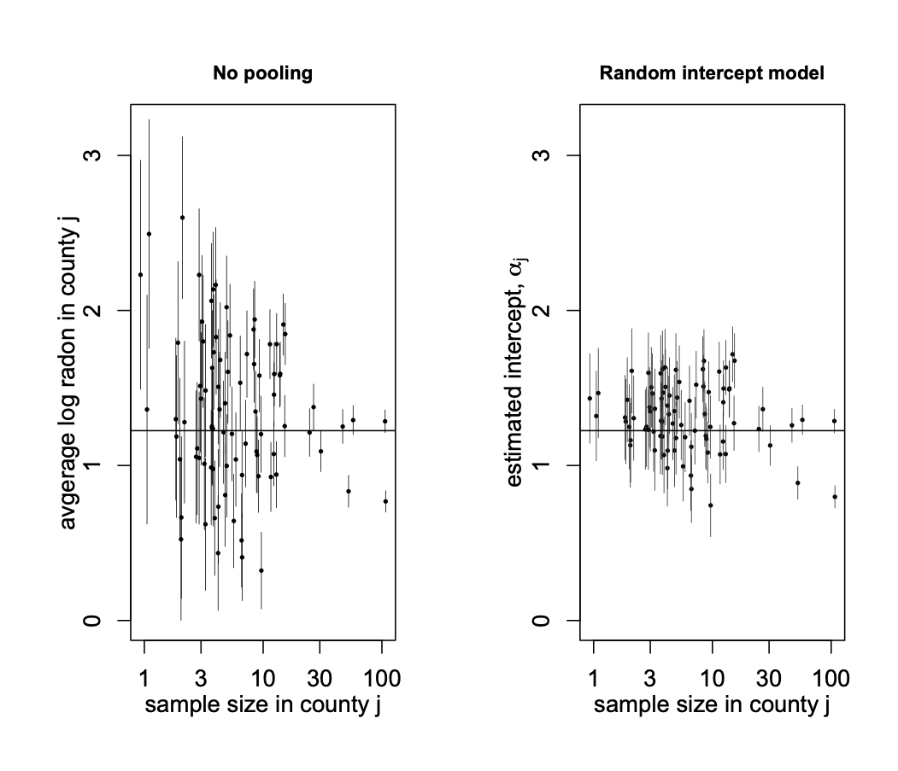
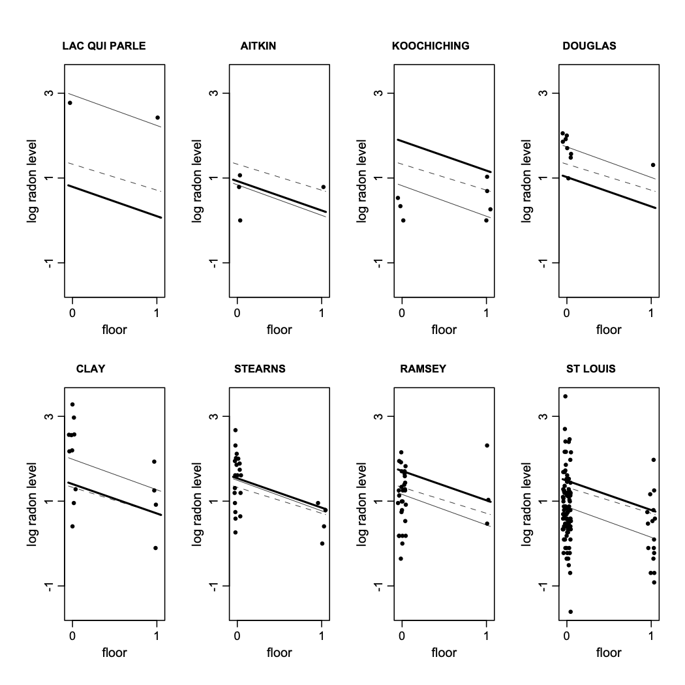
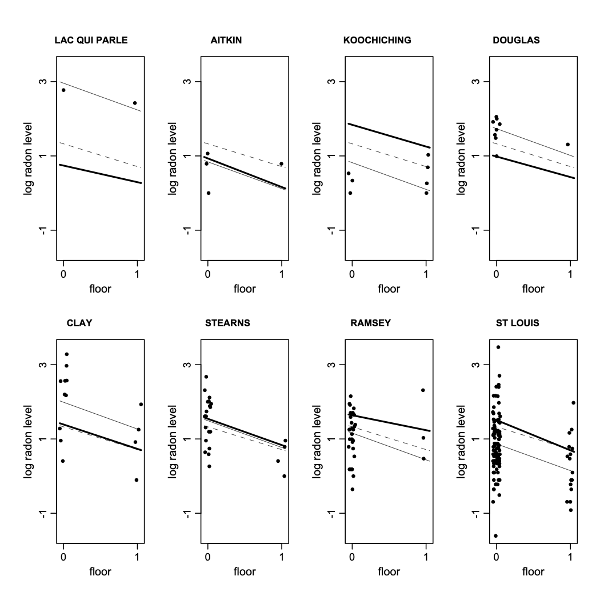

```{r}
#| echo: false
library(tidyverse)
library(bayesrules)
theme_set(theme_gray(base_size = 18))
library(ggplot2)
library(haven)
library(readr)
library(gtsummary)

```

```{r}
#| echo: false
#| include: false

library (arm)

data <- read.table ("radon.dat", header=T, sep=",")
mn <- data$state=="MN"
radon <- data$activity[mn]
log.radon <- log (ifelse (radon==0, .1, radon))
floor <- data$floor[mn]       # 0 for basement, 1 for first floor
n <- length(radon)
y <- log.radon
x <- floor

county.name <- as.vector(data$county[mn])
uniq <- unique(county.name)
J <- length(uniq)
county <- rep (NA, J)
for (i in 1:J){
  county[county.name==uniq[i]] <- i
}

```


## Clustered data

- In linear regression models, we assumed the observations were independent without any underlying structure connecting the subjects.

- This is not a realistic assumption in many data analysis problems. 

- In many problems, data are clustered (i.e., dependent).

- In such cases, observations are collected on related subjects, or there are multiple observations (possibly over time) on the same subject.


## Clustered data

- Clustered data could come from group randomized trials where group of individuals (e.g., siblings), as opposed to individual themselves, are assigned to different treatments. 

- We might also have observational clustered data, where data are collected from related individuals such as families, geographical regions, or in general multiple sources. 

- Data are also clustered when we obtain multiple observations over time from the same individuals. In this case, we refer to the data as longitudinal data. 


## Clustered data

- When dealing with clustered data, we expect measurements within a cluster to be more similar compared to measurements in different clusters.

- That is, the structure of the data introduces correlation among measurements within a cluster. 

- This violates the independence assumption used in linear regression models. 

## Example

- For example, consider the **radon** example discussed in Gelman and Hill (2007).

- Radon is a colorless, odorless, and tasteless radioactive gas that occurs naturally from the decay of uranium in soil, rock, and water. It is the second-leading cause of lung cancer globally and can build up to dangerous concentrations inside homes and buildings

- The concentration of radon varies in US homes. EPA has started a project to collect radon measurements from a random sample.

## Example

```{r}
glimpse(data)
```

## Example

- We could assume these observations are independent. However, a more realistic assumption is that measurements within a county tend to be more similar compared to measurements from different counties. 

- That is, we expect the measurements to form clusters within each county, and the overall radon level varies from one county to another.   

- In this example, the data have a hierarchical structure: houses within counties. 

- In general, we could have more than two levels: we could divide counties among states, and we could have multiple observations (i.e., repeated measurements) from each house. 

- Clustered data are not always nested (i.e., hierarchical). For example, we can obtain radon measurements over several years. In this case, _years_ and _counties_ are not nested. 


## To pool or not to pool!

- To model such data, we could ignore the underlying structure and _pool_ all counties together and fit a single model to the whole data. We refer to this approach as _complete pooling_.

- This method, of course, ignores variation between counties.  

- Alternatively, we could fit a separate model to data from each county. We refer to this approach as _no pooling_. 

- This is an inefficient approach that fits many models ($\sim$ 3000 in the radon example), where the estimated parameters in most of them are based on a small sample size, which results in large standard errors. 

- A reasonable compromise between complete pooling and no pooling is provided by _multilevel models_ that perform _partial pooling_.

- These methods take the underlying structure of the data into account, and they tend to provide more reasonable estimates.  

## Multilevel models

- Multilevel models allow us to investigate how some effects vary by group; this is analogues to including interaction terms (here, between covariates and the group indicator) in classical models. 

- These models provide a reasonable compromise between complete pooling, which is very restricted, and no pooling, which is overly flexible. 

- Multilevel models could lead to better inference by capturing the overall trend while taking the group effect into account. 

- Using multilevel models, we can model higher level data (e.g., radon level in counties) using their own specific covariates. For the radon problem, we can use, for example, a measurement of soil uranium, which is available at the county level only.

## Two-stage models

- Consider the radon data. We would like to estimate the effect of the _floor_ variable, which indicates the floor of measurement (basement is coded as 0, first floor as 1, $\ldots$).

- To fit a multilevel model, we can use a two-step model for the two levels of the data. 

- We use the following model for observations within each county:
\begin{eqnarray*}
y_{ij} & = & \alpha_{i} + \beta x_{ij} + \epsilon_{ij}
\end{eqnarray*}
where $y_{ij}$ is the measurement for the $j^{th}$ house in the $i^{th}$ county, and $x_{ij}$ is the first-floor indicator.

- Note that in this model, we are assuming that the overall radon level varies from one county to another. However, the floor effect remains the same for all counties. This is a _random-intercept_ model.

## Two-stage models

- Next, we model the variation of intercepts among counties as follows:
\begin{eqnarray*}
\alpha_{i} & = & \mu_{\alpha} + \eta_{i}
\end{eqnarray*}

- The model at the higher level can itself depend on some covariates. For example, our model for random intercepts can depend on $z_{i}$, county level measurements of soil uranium:
\begin{eqnarray*}
\alpha_{i} & = & \mu_{\alpha} + \gamma z_{i} + \eta_{i}
\end{eqnarray*}


## Mixed effect models

- Alternatively, we can combine the above two model and write the result as a mixed-effect model
\begin{eqnarray*}
y_{ij} | \alpha_{i} & \sim & N(\alpha_{i} + \beta x_{ij}, \sigma^{2}_{y})\\
\alpha_{i} & \sim & N(\mu_{\alpha}, \sigma^{2}_{\alpha})
\end{eqnarray*}

- The assumed distribution for $\alpha_{i}$ shrinks the random intercepts towards their overall mean, $\mu_{\alpha}$. 

- If our model for random intercepts depend on a higher level covariate, $z_{i}$, we have
\begin{eqnarray*}
\alpha_{i} & \sim & N( \mu_{\alpha} + \gamma z_{i}, \sigma^{2}_{\alpha})
\end{eqnarray*}


## Mixed effect models

- It is now easy to see how multilevel models can be considered as a compromise between complete pooling and no pooling. 

- As $\sigma^{2}_{\alpha} \to 0$, the estimates for $\alpha_{i}$ shrink all the way to $\mu_{\alpha}$. Therefore, in limit, as $\sigma^{2}_{\alpha} \to 0$, the multilevel model becomes equivalent to the model with complete pooling. 

- On the other hand, as $\sigma^{2}_{\alpha} \to \infty$, the multilevel model converges to the model with no pooling.  

## Radon example

- We now discuss the application of mixed effects models for analyzing the radon data.

- We focus on the counties in Minnesota.

- First, we fit a model without any predictor. Next, we include the variable _floor_ as a predictor in our model. 

- To fit mixed effects models, we use the function __lmer__ from the __lme4__ package. 

- Alternatively, we can use the __lme__ function from the __nlme__ package.


## Radon example

Random intercept model without covariates

```{r}
M0 <- lmer(y ~ 1 + (1 | county), REML = FALSE)
summary (M0)
```


## Radon example

::: {.v-center}
{width=50%}
:::


## Radon example

Random intercept and a fixed coefficient for _floor_

```{r}
M1 <- lmer (y ~ x + (1 | county), REML = FALSE)
summary (M1)
```


## Radon example
dashed line: complete pooling; solid thin line: no pooling; solid thick line: partial pooling

::: {.v-center}
{width=50%}

:::


## Radon example

Random intercept and a random covariate

```{r}
M2 <- lmer (y ~ x + (x | county), REML = FALSE)
summary (M2)
```


## Radon example

dashed line: complete pooling; solid thin line: no pooling; solid
thick line: partial pooling

::: {.v-center}

{width=50%}

:::


## A general form

- Consider the following mixed effects model
\begin{eqnarray*}
y = x\beta + z\gamma + \epsilon
\end{eqnarray*}
where $\beta$ and $\gamma$ are vectors of fixed and random effects respectively.

- In this course, we assume normal distributions for $\gamma$ and $\epsilon$, and write the above model as follows:
\begin{eqnarray*}
y | \gamma & \sim & N(x\beta + z \gamma, \Sigma)\\
\gamma & \sim & N(0, \Lambda)
\end{eqnarray*}

## A general form

- The mean and covariance matrix of $y$ are
\begin{eqnarray*}
E(y) & = & E(E(y|\gamma))\\
  & = & E(x\beta + z\gamma)\\
  & = & x\beta \\ \\
Cov(y) & = & E(Cov(y|\gamma)) + Cov(E(y|\gamma))\\ 
  & = & \Sigma + Cov(x\beta + z\gamma)\\
  & = & \Sigma + Cov(z\gamma)\\
  & = & \Sigma + z \Lambda z^{T}
\end{eqnarray*}

- This leads to the following **marginal model**:
\begin{eqnarray*}
y  & \sim & N(x\beta, V) \textrm{ with} \quad V =  \Sigma + z \Lambda z^{T}
\end{eqnarray*}


## Statistical inference for LME models

- Using the above marginal model, we can write down the likelihood function and find the maximum likelihood estimates for model parameters. 
\begin{eqnarray*}
f(y) = \frac{1}{(2\pi)^{n/2}|V|^{1/2}}\exp\Big[-\frac{1}{2}(y - x\beta)^{T}V^{-1}(y - x\beta) \Big]
\end{eqnarray*}

- The log-likelihood (up to a constant) can be written as
\begin{eqnarray*}
L(\beta, \theta) = -\frac{1}{2} \log(|V|) -\frac{1}{2}(y - x\beta)^{T}V^{-1}(y - x\beta) 
\end{eqnarray*}
where $\theta$ represents the set of parameters for the covariance part of the model. 


